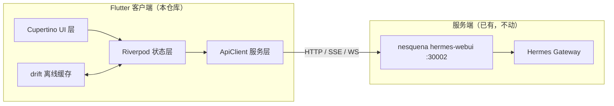
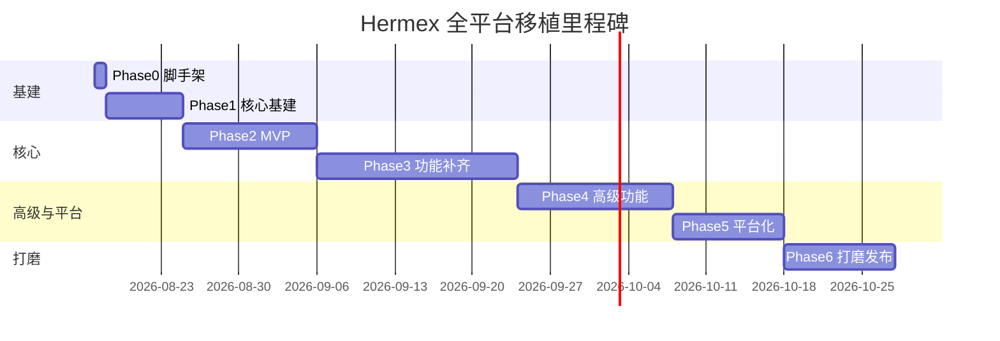

# Hermex 全平台移植实施计划（Flutter + Cupertino）

> 版本：v1.1 ｜ 日期：2026-08-19 ｜ 状态：功能完成（Phase 1-6 主体合入 main，v0.1.0 发布收尾中）
> 目标：将 Hermex（iOS 原生 SwiftUI 客户端）移植为 Flutter 全平台客户端，界面质感对齐 Hermex，API 契约对齐 nesquena/hermes-webui

---

## 1. 项目背景与目标

### 1.1 背景
- **Hermex**（github.com/uzairansaruzi/hermex）：MIT 开源，1.1k stars，iOS 18+ 原生 SwiftUI App，是 hermes-webui 生态最成熟的移动端控制台。**iOS 专属，无 Android 计划**（项目意图明确写死 iOS only，3 个社区移植 PR 全被拒）。
- 主人现有环境：
  - Hermes gateway 常驻（QQ Bot 通道）
  - `D:\hermes-webui` = nesquena/hermes-webui fork，跑 30002，经 frp 暴露公网
  - Hermes Desktop（Windows）、Web UI（手机浏览器访问慢/卡/通知不及时）
- 缺口：**Android 端**（手机主要诉求）、桌面统一体验、通知推送。

### 1.2 目标
用 Flutter + Cupertino 重写一个全平台客户端（iOS / Android / Windows / macOS / Linux / Web），做到：
1. 界面质感与 Hermex 高度接近（≥90% 视觉还原）
2. API 契约与 nesquena hermes-webui 完全兼容（复用 Hermex 已逆向的契约，零探索成本）
3. 补齐 Android 后台回合完成通知（解决"任务完成不通知"痛点）
4. 单一代码库，一套逻辑跑六平台

### 1.3 非目标（明确不做）
- 不做服务端逻辑（执行平面仍是 hermes-webui / Hermes gateway）
- 不 1:1 复刻 iOS 专属能力（Live Activity / Share Extension / AppIntents 换成各平台等价物）
- 不做 AI 视频/图像生成等 webui 之外的扩展功能

---

## 2. 现状调研结论（已实测，2026-08-16）

### 2.1 Hermex 代码量
| 项目 | 数值 |
|---|---|
| Swift 文件数 | 191 |
| 业务代码 | ~6.9 万行 |
| 测试代码 | ~4.3 万行 |
| 主要模块 | Features(130 文件) / Models(23) / Networking(22) |

### 2.2 分层架构（移植时逐层对照）
```
HermexMobile/
├── Features/          # 业务页面：Chat, SessionList, Kanban, Tasks, Skills,
│                      #   Memory, Workspace, Insights, Settings, Onboarding, Share
├── Models/            # 23 个数据模型：Session, ChatMessage, ToolCall, Cron,
│                      #   Approval, Clarification, Kanban, Memory, Workspace...
├── Networking/        # APIClient + 12 个域扩展 + SSEClient + MultipartFormData
│                      #   + Endpoints.swift（590 行，约 150 个端点）
├── Config/ Persistence/ LiveActivities/ AppIntents/ Auth/
└── HermesMobileApp.swift
```

### 2.3 UI 控件构成（已 grep 统计）
全部是标准 SwiftUI 控件，无冷门自绘：`List`(77)、`Section`(95)、`Form`(13)、`NavigationStack`(35)、`ScrollView`(56)、`TextField`(44)、`ToolbarItem`(57)、`ProgressView`(71)、`Toggle`(15)、`Picker`(14)、`Slider`(3)、`Stepper`(1)、`Alert`(6)、`Grid`(8)。
→ **结论：Flutter Cupertino 组件库逐项有对应，视觉还原可行。**

---

## 3. 技术选型

| 领域 | 选型 | 理由 |
|---|---|---|
| 框架 | Flutter 3.x + Dart 3.x | 六平台单代码库 |
| UI 组件 | **Cupertino widgets**（全量） | 官方 iOS 风格，对齐 HIG |
| 状态管理 | Riverpod 2.x | 声明式、轻量，贴近 SwiftUI 心智 |
| 网络 | dio（HTTP）+ sse_client（SSE 流） | SSE 是聊天/审批/澄清流的核心 |
| WebSocket | web_socket_channel | Kanban 事件流 |
| 路由 | go_router | 桌面/移动/Web 统一 |
| Markdown | flutter_markdown（可定制） | 消息渲染 |
| 离线缓存 | drift（SQLite） | 会话只读缓存、草稿 |
| 安全存储 | flutter_secure_storage | API Key |
| 图表 | fl_chart | Insights 统计 |
| TTS/STT | 平台原生通道 | Android/iOS 系统能力 |
| 字体 | 平台自适应：iOS=SF Pro，其他=Inter/思源黑体 | 逼近苹果字体观感 |
| 测试 | flutter_test + mocktail + 契约测试脚本 | 对齐 Hermex 测试思路 |

---

## 4. 目标平台与交付物

| 平台 | 最低版本 | 交付形式 |
|---|---|---|
| iOS | 15+（低于 Hermex 的 18，扩大覆盖） | App Store / TestFlight |
| Android | 8.0 (API 26)+ | APK / AAB（含后台通知） |
| Windows | 10 1809+ | MSIX / exe |
| macOS | 12+ | dmg |
| Linux | 主流发行版 | AppImage / deb |
| Web | 现代浏览器 | PWA（可安装 + 可选推送） |

---

## 5. 架构设计

### 5.1 总体数据流


### 5.2 仓库目录结构（Flutter 端）
```
hermex-flutter/
├── lib/
│   ├── main.dart                  # 入口（平台分支：移动/桌面/Web）
│   ├── app/
│   │   ├── app.dart               # MaterialApp 壳 + Cupertino 主题
│   │   ├── router.dart            # go_router 路由表
│   │   └── theme/
│   │       ├── cupertino_theme.dart    # 深/浅色 CupertinoTheme
│   │       └── typography.dart         # 字体策略
│   ├── core/
│   │   ├── api/
│   │   │   ├── api_client.dart         # dio 封装 + 认证头
│   │   │   ├── endpoints.dart          # 端点表（对照 Hermex Endpoints.swift）
│   │   │   ├── sse_client.dart         # SSE 流式封装
│   │   │   ├── ws_client.dart          # Kanban 事件流
│   │   │   └── api_error.dart
│   │   ├── models/                     # 23 个模型（对照 Hermex Models/）
│   │   ├── cache/                      # drift 表 + 会话缓存
│   │   └── utils/                      # 时间、格式化、Markdown 扩展
│   ├── features/
│   │   ├── onboarding/                 # 服务器连接配置向导
│   │   ├── session_list/               # 会话列表/搜索/归档
│   │   ├── chat/                       # 流式聊天（核心）
│   │   ├── tasks/                      # Cron 任务 CRUD
│   │   ├── skills/                     # 技能浏览
│   │   ├── memory/                     # 记忆查看
│   │   ├── workspace/                  # 文件浏览器 + 上传
│   │   ├── kanban/                     # 看板（事件流）
│   │   ├── insights/                   # 用量统计
│   │   └── settings/                   # 模型/服务器/外观
│   └── platforms/
│       ├── notifications/              # Android 通知通道 + 桌面通知
│       └── app_intents/                # 桌面全局快捷键（等价物）
├── test/                               # 单元 + widget + 契约测试
├── tools/fake_gateway/                 # 本地模拟 hermes-webui（契约测试）
└── docs/                               # 开发文档、API 变更跟踪
```

---

## 6. 模块映射表（Hermex Swift → Flutter）

| Hermex (Swift) | Flutter 对应 | 工作量 | 备注 |
|---|---|---|---|
| `APIClient.swift` + 12 扩展 | `core/api/`（dio） | 中 | 150 端点，逐个迁移 |
| `SSEClient.swift` | `sse_client` 包封装 | 中 | 重连/心跳策略要重写 |
| `KanbanEventStreamClient.swift` | `ws_client.dart` | 中 | web_socket_channel |
| `Endpoints.swift` (590 行) | `endpoints.dart` | 低 | 直接翻译 |
| 23 个 `Models/*` | `core/models/*` | 低 | JSON 解析，容错解码 |
| `ChatViewModel.swift` (5773 行) | `features/chat/chat_controller.dart` | 高 | 流式状态机核心 |
| `Kanban*` (5600 行) | `features/kanban/*` | 高 | 拖拽/事件流 |
| `SessionList*` | `features/session_list/*` | 中 | 列表+搜索 |
| `Tasks*` / `Skills*` / `Memory*` | 对应 features | 低-中 | CRUD 为主 |
| `SettingsView.swift` (2371 行) | `features/settings/*` | 中 | 表单密集 |
| `Workspace*` | `features/workspace/*` | 中 | 文件树+上传 |
| `LiveActivities` | Android 通知 + 桌面通知 | 中 | **平台等价物，非复刻** |
| `ShareExtension` | 平台分享（移动端） | 低 | 可后置 |
| `AppIntents` | 桌面快捷键/URL scheme | 低 | 可后置 |

---

## 7. 分阶段实施计划

### Phase 0 — 环境与脚手架（0.5 天）
- [x] 安装 Flutter SDK（Windows，含 Android toolchain；iOS 构建需 macOS 或 CI）
- [x] `flutter create` 脚手架 + 平台目录清理
- [x] 接入 CI（GitHub Actions：analyze + test + build android/windows/web）
- [x] 提交初始骨架（git init，分支约定）

### Phase 1 — 核心基建（1 周）
- [x] `core/api`：dio 封装、认证（API Key / Cookie）、错误归一化
- [x] `endpoints.dart`：150 端点迁移（对照 Hermex Endpoints.swift 逐条）
- [x] 23 个 Models 迁移（容错解码，对齐 Hermex 的 tolerant 策略）
- [x] SSE 客户端（心跳、断线重连、消息顺序）
- [x] 连接配置 + 多服务器保存（flutter_secure_storage）
- [x] Cupertino 主题（深/浅色）+ 字体策略
- **验收**：连接真实 30002，拉取会话列表成功；单元测试覆盖 ApiClient 解析

### Phase 2 — MVP（1.5-2 周）
- [x] 会话列表（分页、搜索、pin/archive/delete/branch；后续补齐筛选/批量/项目/搜索高亮深链，见 Phase 3 备注）
- [x] 聊天核心：SSE 流式渲染、思考/工具调用卡片、Markdown、代码块
- [x] 模型切换（每会话/全局）、reasoning effort
- [x] 附件上传（图片/文件，multipart，10 个/64MiB 上限）
- [x] 中途 steer / stop
- **验收**：Android 真机 + Windows 桌面可完成一次完整流式对话 + 附件上传

### Phase 3 — 功能补齐（2-3 周）
- [x] Tasks（Cron 列表/创建/编辑/启停/触发/输出查看）
- [x] Skills 浏览、Memory 查看
- [x] Workspace 文件树 + 上传/下载/删除（删除/重命名端点 2026-08-19 接线，fake_gateway 已同步；真实服务端支持待验证）
- [x] Approval / Clarify / sudo 审批流（聊天内审批/澄清卡片 + respond，chat_spec §2.3）
- [x] Settings 全量（模型、服务器、外观、verbose 模式）
- [x] 多 Profile 切换（切换时正确加载 profile home）
- **验收**：对照 Hermex 功能清单逐项勾选，无缺失

### Phase 4 — 高级功能（2 周）
- [x] Kanban 看板（boards/cards/依赖/事件流/worker 日志；跨列拖拽已完成，同列排序待服务端顺序端点）
- [x] Insights 用量统计（fl_chart）
- [x] Git 面板（status/diff/commit/push/pull）
- [x] 离线只读缓存（drift：最近会话）
- [x] 会话导出（Markdown/JSON）
- **验收**：Kanban 事件实时刷新；断网重连后消息不丢

### Phase 5 — 平台化（1-2 周）
- [x] **Android 后台回合完成通知**（前台服务 + 通知通道，对齐 hermes-android v2.0.1 的 Background turn notifications）
- [x] Android 深链（通知点击回跳 `/chat/:sessionId`；搜索深链 `/chat/:id?q=` 定位）
- [ ] iOS URL scheme（需 macOS 环境验证）
- [ ] 桌面：窗口记忆、全局快捷键、系统托盘
- [ ] Web：PWA manifest + 可安装；可选 Web Push（评估 FCM 国内可用性，否则跳过）
- **验收**：手机退后台任务完成弹通知 ✅；桌面窗口体验正常 ❌（未做）

### Phase 6 — 打磨（1-2 周）
- [ ] 动画手感（Spring 曲线参数对照 SwiftUI：`spring(duration:bounce:)` → Flutter `Curves`/自定义 `TweenAnimationBuilder`）
- [x] 触觉反馈（HapticFeedback：`AccessibleButton` + haptic helpers 已落地，既有按钮渐进迁移中）
- [x] 主题细节、空态/错误态、加载骨架（golden 截图测试 20+ 屏 + 对比度自动扫描）
- [x] 无障碍（语义标签：`AccessibleButton` 新增，既有页面待迁移；字体缩放未专项验证）
- [x] 国际化（中文/英文：框架层 en/zh + 业务文案基础 facade；完整 ARB 抽离待续）
- **验收**：与 Hermex 截图逐屏对比，视觉差异清单清零 ❌（未做，需 Hermex 真机截图）

**总计：单开发者约 9-13 周；两人并行（1 基建+UI / 1 业务）可压至 6-8 周。**

---

## 8. API 契约摘要（hermes-webui，源自 Hermex Endpoints.swift 实测）

| 域 | 关键端点（示意） |
|---|---|
| 会话 | `GET /api/sessions`、`/api/sessions/{id}`、new/rename/delete/pin/archive/branch/compress/undo/retry/truncate/move/export |
| 聊天 | `POST /api/chat/start`、`/api/chat/stream/{id}`（SSE）、cancel、steer、status |
| 审批 | `GET /api/approvals/pending`、stream（SSE）、respond |
| 澄清 | `GET /api/clarify/pending`、stream（SSE）、respond |
| 工作区 | workspaces CRUD、directory list、file/rawFile/media |
| Git | info/status/branches/diff/fetch/pull/push/checkout/stage/commit |
| 模型 | models、modelsLive、defaultModel、reasoning |
| 人格/Profile | personalities、setPersonality、profiles、switchProfile |
| Cron | crons CRUD + run/pause/resume/status/output/deliveryOptions |
| Kanban | boards/cards/events/eventsStream（WS）/dispatch/stats/workerLog |
| 记忆 | memory、memoryWrite、memorySearch 等 |
| 其他 | insights、providers、settings、updates、transcribe、tts、upload、server panels |

> 完整 590 行端点定义见 Hermex 源码 `Networking/Endpoints.swift`；实现时以**真实 30002 服务器抓包/契约测试**为准（Hermex 仓库的 CONTRACT_TESTS.md 有 pin-advance 策略可参考）。

---

## 9. 关键难点与对策

| # | 难点 | 对策 |
|---|---|---|
| 1 | SSE 在移动网络下断线/粘包 | 心跳 + 指数退避重连 + 游标恢复（Hermex 有可参考实现思路） |
| 2 | 动画手感不像 iOS | 逐条调 Spring 参数；关键路径做录屏对比 |
| 3 | 字体观感 | 平台自适应字体栈；CJK 用思源黑体 |
| 4 | 平台专属能力缺失 | Android=通知/前台服务；桌面=托盘/快捷键；Web=Push（受限于 FCM 国内可达性） |
| 5 | Markdown 渲染不一致 | 锁定 flutter_markdown 版本 + 自定义渲染器对齐 Hermex 的代码块/表格样式 |
| 6 | 上传限制（10 附件/64MiB） | 客户端预检 + 压缩（图片采样降级）+ 顺序上传/重试 |
| 7 | API Key 安全 | flutter_secure_storage（Android Keystore / iOS Keychain） |
| 8 | 多 Profile 切错 home | 切换时显式携带 profile 参数，复刻 Hermex 的 profile-scoped 逻辑 |
| 9 | 上游 API 漂移 | 契约测试脚本（对照 `smoke.sh` 思路）+ 版本 pin + 升级前跑测试 |

---

## 10. 测试策略

| 层级 | 内容 | 参考 |
|---|---|---|
| 单元 | 模型解析（容错）、Controller 状态机、端点拼接 | Hermex 4.3 万行测试场景 |
| Widget | 会话列表、聊天流、设置表单 | — |
| 契约 | `tools/fake_gateway/` 本地模拟服务器，验证 150 端点形状 | Hermex CONTRACT_TESTS.md + rusty4444 fake_gateway |
| 集成 | 连真实 30002 冒烟（每迭代一次） | — |
| 平台 | Android 真机通知、Windows 桌面窗口、Web PWA | — |

---

## 11. 风险清单

| 风险 | 等级 | 缓解 |
|---|---|---|
| 上游 webui API 变动导致大面积返工 | 中 | 契约测试 + pin 版本 + 升前检查 |
| Kanban 事件流复杂度低估 | 中 | Phase 4 单独立项，先出只读版 |
| 全平台打磨工作量膨胀 | 高 | 优先 Android + Windows（主人主用），macOS/Linux/Web 后置 |
| 通知在国内网络环境不可达（FCM） | 中 | 备选：轮询式本地通知 / QQ 推送兜底 |
| 单人长期维护意愿 | 中 | 保持小而精，复用 Hermex 契约避免自造 |

---

## 12. 里程碑时间表（单开发者估算）



---

## 13. 参考资源

- Hermex 源码：https://github.com/uzairansaruzi/hermex （MIT，本计划的主要移植蓝本）
- hermes-webui：https://github.com/nesquena/hermes-webui （API 契约来源）
- 主人 fork：`D:\hermes-webui`（30002，frp 已暴露公网）
- Flutter Cupertino 目录：https://docs.flutter.dev/ui/widgets/cupertino
- 可参考实现：rusty4444/hermes-android（v2.0.1，Android 通知 + fake_gateway 契约测试思路）
- 上游契约跟踪：Hermex `CONTRACT_TESTS.md` / `UPSTREAM_TESTED_SHA`

---

## 14. 项目决策记录（2026-08-16 已定）

1. **优先级**：Android + Windows 先行，macOS / Linux / Web 后置
2. **仓库**：GitHub **公开** → https://github.com/silent-reader-cn/hermex-flutter
3. **项目名**：`hermex-flutter`
4. **工具链**：Flutter SDK → `C:\Users\Admin\flutter`（D 盘满迁 C 盘）；JDK 17 → `D:\Java`；Android SDK 36 → C 盘标准位置；VS Build Tools 2022（已有）
5. **领头人**：柚子（Hermes Agent）——负责架构设计、任务划分、代码风格统一、子代理成果验收
6. **推进方式**：并行子代理分工（文件级分区，领头人逐批验收合并，子代理不 commit）
7. **fluter 命令环境**：MSYS bash 下必须用 `C:\tmp\f.bat` 封装（HOME/PATH 污染问题）

## 15. 进度日志

| 日期 | 里程碑 |
|---|---|
| 2026-08-16 | 工具链全就绪（Flutter 3.47.0 / JDK17 / SDK36 / licenses）；脚手架 + 依赖 + lint 入仓（a371dbf） |
| 2026-08-16 | 预研规格 3 份验收通过：models_spec(145 模型) / api_spec(123 端点) / chat_spec(9 态状态机) |
| 2026-08-16 | Phase 1 编码进行中：core/models + core/api 双线程（deleg_011b30ed） |
| 2026-08-17 | Phase 1-6 全功能合入 main：722 测试全绿、analyze 零告警、Android debug APK 可构建（CHANGELOG v0.1.0） |
| 2026-08-18 | Phase 2 会话缺口补强（feat/session-gaps-phase2 批 1-2 合入）：筛选/归档/批量/项目 CRUD、聊天会话操作（压缩/撤销/重试/设置/YOLO/只读）、消息级操作、搜索高亮+深链定位 |
| 2026-08-19 | workspace 删除/重命名端点接线 + fake_gateway 同步；CI 工作流落地（analyze+test / android debug / fake_gateway smoke）；**842 测试全绿、analyze 零告警** |
| 2026-08-19 | 批 1 完成：桌面平台化（托盘/快捷键/窗口记忆）+ Web PWA + core 事件类型化 → 886 测试 |
| 2026-08-19 | 批 2 完成：api 域全类型化（~150 处 Object? 收敛）+ 无障碍迁移（AccessibleButton+动态字号审计）→ 904/896 测试 |
| 2026-08-19 | 批 3 完成：ARB 业务文案全量抽离（~200 处硬编码）→ 942 测试；iOS URL scheme 深链冷启动 |
| 2026-08-19 | **B/C 系列全部完成**：桌面/PWA/iOS 深链/上游联动 + 类型化/无障碍/ARB。**942 测试全绿、analyze 零告警**。B/C 剩余：桌面托盘图标自定义、iOS 热启动深链（需 macOS） |
