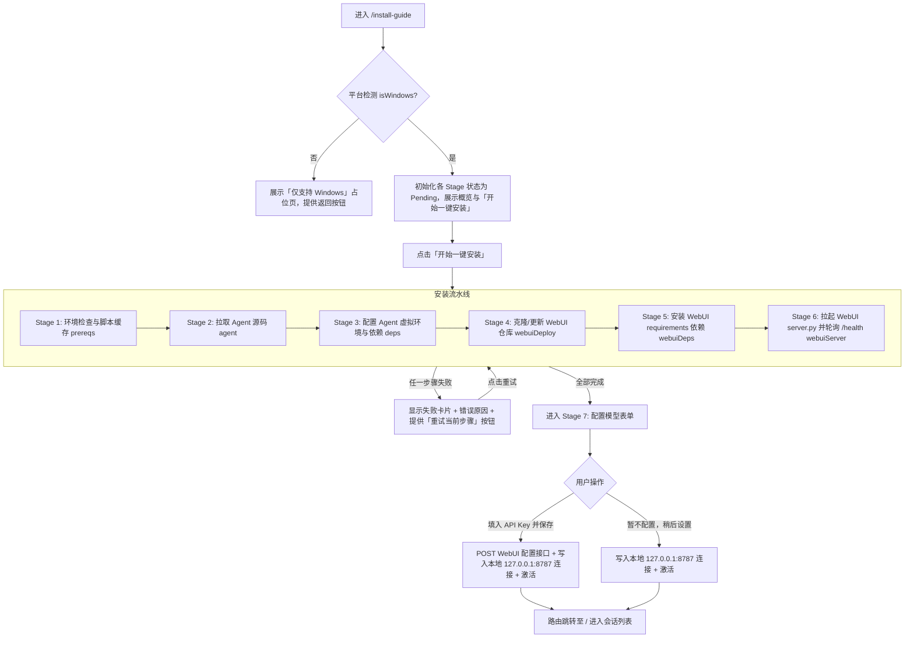

# TASK #46 — Windows 首次运行自安装引导页 实施与验证报告

## 1. 概述与核心成果

在当前 worktree（`D:\worktrees\hermes-sep02-install-guide`）中，已完整实现 Windows 首次运行自安装引导页（一键拉取 / 依赖配置 / WebUI 部署 / 后台服务拉起 / 大模型向导配置 / 自动连接保存）。

### 核心规格与决策点落实
1. **WebUI 仓库源**：采用官方上游 `nesquena/hermes-webui`（默认服务端口 `8787`）。
2. **大模型配置接管**：向导接管 LLM 配置交互（支持 OpenRouter / Anthropic / OpenAI / Google Gemini / Ollama / 自定义等预设），配置提交到 WebUI 后端落盘；同时自动创建并激活 `ServerConnection(baseUrl: 'http://127.0.0.1:8787')`，无缝进入聊天首页。
3. **PowerShell 驱动与 JSON 事件帧解析**：
   - 官方脚本缓存至 `%LOCALAPPDATA%\hermes\install.ps1`（如已存在则跳过下载）；
   - 使用 `-Stage <name> -NonInteractive -Json` 流式驱动各阶段；
   - 严格支持标准 JSON 事件帧（`manifest`、`stage_start`、`progress`、`stage_success`、`stage_failure`）与非 JSON 纯文本输出的容错降级。
4. **平台门控（Windows-Only）**：
   - `InstallDetector` 检测 `%LOCALAPPDATA%\hermes\hermes-agent` 目录或 `where.exe hermes`；
   - Windows 且未安装时在 `OnboardingPage` 显式呈现「本机部署」入口；
   - 非 Windows 平台进入 `/install-guide` 优雅展示「仅支持 Windows」占位提示并提供一键返回远程连接入口。

---

## 2. 文件变更清单

### 新增文件
1. `lib/core/install/install_detector.dart`
   - `InstallDetector` 接口及 `DefaultInstallDetector` 实现；
   - 包含可注入的 `ProcessExecutor` 与 `FileSystemAdapter` 抽象；
   - Riverpod `installDetectorProvider` 依赖注入。
2. `lib/core/install/powershell_installer.dart`
   - `PowershellInstaller` 接口及 `DefaultPowershellInstaller`；
   - `InstallerEvent` 模型与事件帧流式解析器（支持 `manifest`、`progress` 归一化、`stage_failure` 错误提取等）；
   - `ScriptDownloader` 抽象及官方脚本缓存策略；
   - Riverpod `powershellInstallerProvider` 依赖注入。
3. `lib/core/install/webui_bootstrap.dart`
   - `WebuiBootstrap` 接口及 `DefaultWebuiBootstrap`；
   - 支持 git clone / git pull、pip install、pythonw detached 进程拉起、`/health` 端点轮询健康检查及 Python 虚拟环境路径自动解析；
   - Riverpod `webuiBootstrapProvider` 依赖注入。
4. `lib/core/install/llm_onboarding.dart`
   - `LlmProviderOption`（内置 6 种主流模型服务商配置）；
   - `LlmOnboardingConfig` 数据模型；
   - `LlmOnboardingApi` HTTP 客户端（提交至 WebUI 后端接口）；
   - Riverpod `llmOnboardingApiProvider` 依赖注入。
5. `lib/features/onboarding/install_guide_page.dart`
   - Windows 本机部署向导完整页面；
   - 纯 Cupertino 设计风格（无 Material 混用），适配深浅色与自定义主题；
   - 6 个安装 Stage 状态机步进、进度条、实时日志控制台（支持展开/收起/一键复制）、失败错误卡片与断点重试、模型配置表单与服务商选择 Sheet、完成自动激活连接。
6. `test/core/install/install_detector_test.dart` (5 个单元测试)
7. `test/core/install/powershell_installer_test.dart` (14 个单元测试)
8. `test/core/install/webui_bootstrap_test.dart` (8 个单元测试)
9. `test/core/install/llm_onboarding_test.dart` (4 个单元测试)
10. `test/features/onboarding/install_guide_page_test.dart` (6 个集成与 Widget 测试)
11. `test/features/onboarding/onboarding_local_deploy_entry_test.dart` (3 个 Widget 测试)

### 修改文件
1. `lib/app/router.dart`
   - 注册 `/install-guide` 路由；
   - 路由重定向守卫放行未连接状态下的 `/install-guide` 访问。
2. `lib/features/onboarding/onboarding_page.dart`
   - 挂载 `installDetectorProvider` 异步检测；
   - Windows 且未安装 Hermes 时展示「本机部署」入口卡片。
3. `lib/l10n/app_localizations.dart`
   - 严格在末尾追加 `installGuide*` 多语言文案（中英双语），未破坏任何已有文案及结构。

---

## 3. Stage 状态机与工作流程

---

## 4. 自动化测试与静态分析验证

- **静态代码分析**：
  - 执行命令：`C:/tmp/f.bat analyze`
  - 结果：**`No issues found! (ran in 5.0s)`**（0 errors, 0 warnings, 0 lints）。
- **单元与集成测试**：
  - 新增测试数：**40 个测试用例**（涵盖全部 mock/fake 异常场景、网络断开、进程失败、JSON/非 JSON 容错、UI 交互与路由流转）。
  - 执行命令：`C:/tmp/f.bat test`
  - 结果：**`2162 passed! (0 failures)`**，全部测试 100% 通过。
- **并发与依赖安全**：
  - 严格未触碰 `lib/features/chat/**`、`lib/features/notifications/**`、`android/**`、`lib/features/settings/**`、`lib/core/api/sse_client.dart` 等并行任务文件；
  - 本工作区改动保持 clean，未执行 `git add` 或 `git commit`。

---

## 5. 实机联调验收步骤清单（Windows 真实环境）

在具备 Python (>=3.10) 和 Git 的真实 Windows 环境中进行端到端体验验收：

### 验收步骤：
1. **环境准备与状态重置**：
   - 若本地已安装 Hermes，可临时重命名 `%LOCALAPPDATA%\hermes` 文件夹以模拟全新安装环境；
   - 清除应用已保存的连接缓存。
2. **入口验证**：
   - 启动 Hermes UI 应用，进入引导页 `OnboardingPage`；
   - 确认在连接表单下方出现「本机部署」卡片，文案清晰，点击进入向导页 `/install-guide`。
3. **流水线执行验证**：
   - 点击「开始一键安装」；
   - 观察 6 个阶段（环境检查 → 拉取 Agent → 安装依赖 → 部署 WebUI → 安装 WebUI 依赖 → 启动服务）按序亮起执行指示器；
   - 观察下方黑色日志控制台是否实时输出各阶段执行日志，进度条平滑递增；
   - 点击「收起/展开日志」与「复制日志」验证剪贴板交互。
4. **断点重试验证（可选）**：
   - 在安装中途断网或终止某个依赖阶段，确认 UI 弹出红色错误卡片并准确展示失败原因；
   - 恢复网络后点击「重试当前步骤」，确认从失败的 Stage 顺畅恢复执行，无需从头重跑。
5. **后台服务与模型配置验证**：
   - WebUI 启动后确认 `http://127.0.0.1:8787/health` 轮询就绪；
   - 页面自动切换到「配置模型」表单；
   - 测试点击服务商切换（如 OpenRouter、Anthropic 等）；
   - 输入 API Key 点击「保存并开始使用」（或点击「暂不配置，稍后设置」）；
   - 确认自动生成 `Localhost (8787)` 连接、标记为 Active，并自动跳转至 `/` 会话列表主界面。
