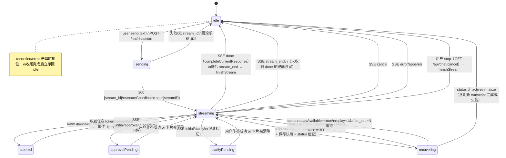

# Hermex Chat 模块 → Flutter 聊天状态机翻译规格

> 蓝本：`.reference/hermex-src/Features/Chat/ChatViewModel.swift`（5773 行，精读）、`ChatStreamCoordinator.swift`、`ChatPendingActionCoordinator.swift`、`ChatView.swift`、`Models/ChatMessage.swift`、`Models/ToolCall.swift`、`Models/MessageAttachment.swift`、`Networking/APIClient+Chat.swift`、`Networking/SSEClient.swift`、`Networking/Endpoints.swift`
> 协议：`docs/PROTOCOL_NOTES.md`（SSE 事件全清单，本文直接引用其事件映射，不再重复定义）
> 约束：严格遵守 `docs/CODING_STYLE.md` §6（Riverpod：Notifier 类名后缀 `Controller`、Provider 命名后缀 `Provider`、Provider 文件与页面同目录）
> 用途：后续编码子代理按本文直接实现 `lib/features/chat/` 的 Dart 代码，不再读 Swift 源码。
> 语义：本文出现的"必须/禁止/一律"为强约束；"建议"为可选。

---

## 1. 总览：ChatViewModel 的职责拆分（Swift → Dart）

Swift 端 `ChatViewModel`（@Observable，单实例持有会话状态）内部委派给三个 Coordinator；Flutter 端按 Riverpod 拆成 1 个主 Controller + 3 个协作者 Controller，全部放 `lib/features/chat/`：

| Swift 组件 | 职责 | Flutter 对应 | 说明 |
|---|---|---|---|
| `ChatViewModel`（主干） | 消息列表、分页、发送/停止/重试/编辑/叉分、本地消息、标题、滚动触发、错误 | `ChatController extends Notifier<ChatState>`（`chat_providers.dart`） | 唯一写 `List<ChatMessage>` 的类 |
| `ChatStreamCoordinator` | 流状态机：activeStreamID、recoveryState、lastEventID、suspended、SSE 事件分发、断线恢复、快照 | `ChatStreamController extends Notifier<ChatStreamState>` | 常驻 `ChatController` 内部，经 `chatStreamControllerProvider` 暴露 |
| `ChatPendingActionCoordinator` | approval/clarify 卡片状态 + 独立 SSE 流 + 轮询兜底 | `ChatPendingActionController extends Notifier<ChatPendingActionState>` | |
| `ChatAttachmentCoordinator` | 附件上传、预览 | `ChatAttachmentController` | 本文不展开（另有附件规格） |
| `ChatViewModel` 派生区 | transcriptMessages / tool groups / reasoning groups / compression card | 只读 `Provider`（派生状态） | 见 §7 |

**命名约定（强制）**：
- 业务状态：`Notifier`/`AsyncNotifier` + `NotifierProvider`；类名以 `Controller` 结尾，Provider 以 `Provider` 结尾。
- 建议文件：`chat_providers.dart`（Controller 与 Provider 声明）、`chat_state.dart`（纯状态类）、`chat_models.dart`（展示层模型）——若单文件超 500 行再拆。

---

## 2. 聊天状态机

### 2.1 状态定义

Hermex 源码没有单一枚举，而是"主阶段 + 若干布尔标志"。Flutter 端用一个 `ChatPhase` 枚举做主状态（UI 主分支只 switch 它），保留布尔标志做细粒度 UI 控制（对齐 Hermex 的可观察属性）。**任何时刻只有一个 `ChatPhase` 生效。**

```dart
enum ChatPhase {
  idle,             // 无流、无发送请求在途（可自由操作）
  sending,          // POST /api/chat/start 在途（isStartingChat）；未拿到 stream_id
  streaming,        // activeStreamID != nil，SSE 连接存活，正常吐字/推理/工具
  steered,          // 子状态：POST /api/chat/steer 已 accepted，流继续，UI 显示"steering"
  approvalPending,  // approvalPrompt != nil（流仍连，见 2.3 注）
  clarifyPending,   // clarificationPrompt != nil
  recovering,       // 传输断开后的恢复期（recoveryState=checking/reconnecting）
  cancelled,        // 收到 cancel 事件（瞬时，收尾后立即回 idle）
  error,            // 收到 error/apperror 或 transportError 且无法恢复（收尾后回 idle）
}
```

**与 Hermex 布尔标志的映射表（翻译时不许丢失）**：

| Hermex 属性 | Flutter 状态位 | 含义 |
|---|---|---|
| `activeStreamID != nil` | `stream.state.activeStreamId != null` | 流存在（streaming/steered/approvalPending/clarifyPending/recovering） |
| `isStartingChat` | `phase == sending` | start 请求在途 |
| `isCancellingStream` | `state.isCancelling` | stop 按钮请求在途 |
| `hasCompletedCurrentResponse` | `stream.state.hasCompletedResponse` | done 已收尾（防 stream_end 重复收尾） |
| `isConnectionSuspended` | `stream.state.isSuspended` | 传输断开/挂起，等待恢复 |
| `recoveryState` | `stream.state.recovery`（`ActiveStreamRecoveryState.idle/checking/reconnecting`） | 恢复阶段 |
| `pendingActionCoordinator.approvalPrompt != nil` | `pendingAction.state.approvalPrompt != null` | 有审批卡片 |
| `pendingActionCoordinator.clarificationPrompt != nil` | `pendingAction.state.clarificationPrompt != null` | 有澄清卡片 |
| `errorMessage / sendErrorMessage` | `state.errorMessage / state.sendErrorMessage` | 错误展示 |
| `isViewingCachedData` | `state.isViewingCachedData` | 离线缓存兜底模式 |

### 2.2 状态迁移图（Mermaid）



### 2.3 每个 SSE 事件如何触发迁移（完整对照表）

SSE 事件 → `ChatStreamController` 处理 → 状态/数据变化。**列在"数据变化"中的都属于消息组装，细节见 §3。**

| 事件 | 数据变化（委托给 ChatController） | 状态影响 |
|---|---|---|
| `token{text}` | `appendAssistantToken`：去重 → 入 `pendingAssistantTokenChunks` → 调度 16ms 合并 flush → 词级 reveal 追加到流式消息 | 保持 streaming；有真实新增 → `markProgress()`（清空恢复计时） |
| `interim_assistant{text, already_streamed}` | `alreadyStreamed==true` 或空文本 → 忽略；否则先 `flushPendingStreamingContent()`，再追加（非 replay 用 `\n\n` 分隔；replay 直连直接拼接），锚定当前流式 assistant 消息 | 保持 streaming；有新增 → `markProgress()` |
| `reasoning{text}` | `appendReasoning`：去重 → `pendingReasoningChunks` → flush 到 `liveReasoningText`（整块，**不走词级 pacing**） | 保持 streaming；有新增 → `markProgress()` |
| `tool`（ToolStarted） | `appendToolCall`：`liveToolCalls.append(ToolCall(id: stableID ?? "live-tool-<uuid>", name, preview, args, isCompleted:false))`；锚定 `toolCallAnchorMessageID` | 保持 streaming；新增 → `markProgress()` |
| `tool_complete`（ToolCompleted） | `completeToolCall`：按 stableID（tid/id/tool_call_id/tool_use_id/call_id）或 name+未完成 匹配 liveToolCalls 中的项，应用 duration/isError/isCompleted=true；匹配不到则作为已完成项 append | 保持 streaming；有更新 → `markProgress()` |
| `title{session_id, title}` | session_id 匹配当前会话才生效：`displayTitle = trim(title)`，空 → "Untitled Session" | 无状态变化 |
| `metering{tps,…}` | session_id 匹配当前会话才生效：`tps_available==true && estimated!=true && tps>0 且有限` → `liveTokensPerSecond` | 无状态变化 |
| `done{usage, session}` | `streamCoordinatorApplyDone`：先 flush 全部缓冲；`applyCompletedStreamSession`（见 §3.7）；`needsTranscriptRefresh = session.messages 为空`；然后 `completeCurrentResponse` | streaming → 结束流（idle）；`hasCompletedResponse=true`；清除 snapshot、lastEventID、streamingAssistantMessageID |
| `initial` | 解码分流：含澄清标记 → `clarificationPending`，否则 `approvalPending`（注意：**approval/clarify 是主流的报警事件，不结束流**） | streaming → approvalPending / clarifyPending（若当前会话且 prompt 非空）；`markProgress()` |
| `approval` | `applyApprovalUpdate`：pending 非空 → 设卡片；空 → 清卡片 | 同上 |
| `clarify` | `applyClarificationUpdate` | 同上 |
| `pending_steer_leftover{text}` | 入队 `queuedSlashMessages`（下轮发送）+ 追加本地 notice "Steering hint was not consumed…" | 无状态变化；有内容 → `markProgress()` |
| `stream_end` | 若 `hasCompletedResponse==false` → 结束 Live Activity(complete)；`finishStream()` | streaming → idle；清 auxiliary monitoring、flush pinned notices、解除队列 |
| `cancel` | `finishStream()`，结束为 cancelled | streaming → cancelled（瞬时）→ idle |
| `error`/`apperror{error\|message}` | 若 `hasCompletedResponse==false` → `sendErrorMessage = message`；`finishStream()` | streaming → error（瞬时）→ idle |
| `transportError`（连接层） | `handleTransportError`：见 §6.3 断线恢复；**不是结束流** | streaming → recovering / suspended |
| `heartbeat`（SSE comment） | 仅证明 transport 存活：recoveryState==checking → 降回 idle；绝不 demote `.reconnecting` | 无 |
| 未知事件 | `ignored`，静默丢弃 | 无 |

**关键迁移规则（编码时必须逐条满足）**：
1. **只有** `done`、`stream_end`、`cancel`、`error` 能结束流（调用 `completeCurrentResponse`/`finishStream`）；token/interim/reasoning/tool/title/metering/approval/clarify 永远不结束流。
2. `done` 先 `completeCurrentResponse`（`activeStreamId=null`、`hasCompletedResponse=true`），随后到达的 `stream_end` 因 `hasCompletedResponse==true` 不再重复收尾，但仍执行 `finishStream`（清残留）。
3. `error` 事件在 `hasCompletedResponse==true` 之后到达时**不显示错误**（done 已收尾，避免误报）。
4. `approvalPending/clarifyPending` 是"流继续 + 弹卡片"：主 SSE 不中断；恢复看门狗在 `hasPendingPrompt==true` 时暂停（见 §6.3），避免卡片期间误判死链。
5. `transportError` 一律走"挂起 → 状态检查 → 重连或 finalize"，**绝不**立即结束流（除非 `activeStreamID==nil`）。
6. 任何一个事件处理都是纯同步的 MainActor 串行；收到事件先记录 `transportActivityDate`，有新增内容再 `markProgress()`。

---

## 3. 消息组装规则

### 3.1 数据流总览（token 的"缓冲 → 合并 → 词级揭示"三段式）

```
SSE token → appendAssistantToken(text)
            ├─ ① 去重（replay 连接生效，见 §6.4）
            ├─ ② pendingAssistantTokenChunks.append(remainder)   ← 只入缓冲，不改 messages
            └─ ③ scheduleStreamingContentFlush()                  ← 16ms 合并计时
                       │
        drainStreamingContentTick() 每 48ms 一跳（词级 reveal）
            ├─ flushAssistantTokens(maxWordUnits: quota)
            │     ← 把缓冲头部按"词配额"追加进流式消息 content
            └─ flushReasoningChunks()（整块）
```
- **为什么这么设计**：`messages` 只允许在 flush 时变更（批量、确定、可测）；`appendAssistantToken` 的返回值（是否新增）同步返回给看门狗作为进度信号。**禁止**每收到一个 token 就重建一次消息列表（会闪烁且破坏 replay 去重不变量）。
- 强制实现：Flutter 端 `ChatState` 同样持有 `pendingAssistantTokenChunks: List<String>` 与 `pendingReasoningChunks: List<String>` 以及一个 `Timer`（建议 `Timer` + 节流，16ms；词级 reveal 48ms/词配额、最大滞后 1s——常量对齐 Swift 默认值 `ChatViewModel` init 参数）。
- **完成路径直接全量 flush**：`done / cancel / error / interim_assistant / 快照恢复` 一律先调 `flushPendingStreamingContent()`（取消待定 tick，把缓冲全部写入消息），保证收尾时文本完整。

### 3.2 流式 assistant 消息的创建与锚定

- `ensureStreamingAssistantMessage()`：若 `streamingAssistantMessageID == null` → 创建 `ChatMessage(role:"assistant", content:"", messageId:"stream-<uuid>", timestamp:now)` 追加到消息列表末尾，记住 ID。**流式期间所有 token/reasoning/tool 都锚定这一条消息**，不再新建。
- `flushAssistantTokens` 更新消息时以 `messageId == streamingAssistantMessageID` 定位，**原地替换**该 ChatMessage（content += appendedContent），其余字段透传。
- 第一条 token 落地前，assistant 气泡可能为空 —— `displayedTranscriptMessages` 中不隐藏空流式消息（`hasStreamingAssistantMessageContent` 由视图判断是否渲染占位）。

### 3.3 `interim_assistant` 与 `already_streamed` 语义（易错点 #1）

- `already_streamed == true`：这段文本已经被 `token` 事件流过了，**必须丢弃**（不要重复追加）。`null`/`false` 才处理。
- 处理顺序（强约束）：先 `flushPendingStreamingContent()`（把积压 token 落地，保证观众不看到 interleaved 乱序），再追加。
- 追加目标：若存在 `streamingAssistantMessageID` → 追加到该消息；分隔符规则：
  - 当前内容非空 且 **非** replay 直连 → 用 `"\n\n"` 分隔（interim 是一个完整段落，与 token 流拼接处需要空行）；
  - replay 直连（`isReplayConnection==true` 且文本是去重后的尾部）→ 直接拼接不加分隔符；
- 若没有流式消息 → 退化为 `appendAssistantToken(text)`。
- 空文本（trim 后）直接返回 false。

### 3.4 `reasoning` 事件

- 去重规则同 token（§6.4 的 `deduplicatedReplayText`，维护 `matchedReasoningLength`）。
- flush 时**整块**追加进 `liveReasoningText`（不走词级配额）。
- 展示：`liveReasoningText` + `completedReasoningGroups`（新回合开始/发送新消息时 `archiveLiveReasoningIfNeeded` 把上一段归档）→ 派生 `reasoningDisplayGroups` 按 assistant turn 分组渲染折叠块。
- 注意：reasoning 不写进 `ChatMessage.content`，独立存储。

### 3.5 工具调用（`tool` / `tool_complete`）→ 消息中的卡片

**实时（live，流期间）**：
- `liveToolCalls: List<ToolCall>`，`ToolCall{id, name, preview, args, duration, isError, isCompleted, startedAt}`。
- `tool` 事件：append（未完成）；`tool_complete` 事件：按以下顺序匹配未完成项并补全：
  1. `stableID`（从事件载荷依次取 `tid / id / tool_call_id / tool_use_id / call_id` 第一个非空）匹配同 ID 项；
  2. 否则匹配 `name` 相同的**最后一个未完成**项；
  3. 都匹配不到 → 直接 append 一个 `isCompleted:true` 的项（服务器只发了完成事件的兜底）。
- `toolCallAnchorMessageID`：本条回合第一个工具事件锚定的 assistant 消息 ID，用于把卡片分组挂到对应气泡。

**归档（done / 服务端 transcript 重载后）**：
- `completedToolCallGroups: List<ToolCallGroup>`，`ToolCallGroup{id, anchorMessageID, toolCalls}`；按 assistant turn 分组（`coalescingByAssistantTurn`），一个回合多工具调用合并成一张"Activity: N tools"卡片。
- done 携带 `session.toolCalls`（persisted）时，`ToolCallGroup.groups(...)` 从 `PersistedToolCall{name, snippet, tid, assistant_msg_idx, args}` 重建；若同时有 live 工具未归档，以 `anchorMessageID` 合并（fallback anchor 为当前回合第一条 assistant 消息）。
- 新回合/新发送开始时 `archiveLiveToolCallsIfNeeded()`：把残留 live 工具归档为 group，再清空 `liveToolCalls`。

**卡片渲染内容（`ToolCallDisplayFormatter` → Dart `toolCallDisplayContent`）**：
- 参数行：`args`（Map）按键名排序，值转显示文本（`toolDisplayText`：对象按缩进树、数组 "- " 列表、字符串归一化换行）。
- 结果：`preview` 非空才渲染：
  1. 尝试把 preview 当 JSON 解析（含去转义、嵌套解包最多 3 层）；
  2. 工具名是 terminal/shell/bash/zsh/command/exec 系列或对象含 `output/stdout/stderr/exit_code/exitCode/error` 键 → 终端信封格式：`output`/`stdout` 优先、接 `stderr`、`Error: …`、非 0 `exit_code`；
  3. 否则按 `result/results/preview/content/text/message/summary/data/items` 顺序取第一个可读值；再试 `error`；都没有 → 对象 JSON 树；
  4. 等宽字体条件：terminal 工具 或 文本含换行 或 由 JSON 解析得出。
- 单条渲染参考 `ToolCallCardView`：名称 + 参数区 + Result 区 + 错误色（isError）。

### 3.6 `title` 事件更新会话标题

- 校验 `payload.sessionId == 当前会话ID`（不匹配直接丢弃）；`title` 为空/纯空白 → 不更新。
- 更新 `displayTitle`（trim；空 → "Untitled Session"），并同步会话列表缓存（若 Flutter 端有会话列表缓存）。
- done 之后若服务器未在流内发 title，`finishStream`（正常完成路径）会触发一次 `refreshCompletedResponseTitleIfNeeded()`：`GET /api/session`（无 messages）补拉标题——**建议实现**（对齐 Hermex 行为）。

### 3.7 `done` 事件的收尾（易错点 #3）

1. `flushPendingStreamingContent()`。
2. 记 `currentStreamingAssistantID`。
3. `hasCompletedTranscript = session.messages 非空`；若非空 → `applyCompletedStreamSession(session)`：
   - `mergingLoadedMessages` 合并（服务端完整 transcript 替换本地流式内容；本地 `local-` 乐观 user 消息保留并插回正确位置）；
   - 重建 `completedToolCallGroups`（见 3.5）；清空 `liveToolCalls`、`liveReasoningText`、锚点 ID、本地附件预览；
   - 更新 title / workspace / model / profile / `contextWindowSnapshot`。
4. `usage` → `contextWindowSnapshot`；`usage.tokensPerSecond` 有限且 >0 → 写入对应 assistant 消息的 `turnTps`（找到 currentTurn 的 assistant 锚点消息）。
5. `completeCurrentResponse(needsTranscriptRefresh: !hasCompletedTranscript)`：
   - `activeStreamID = null`、`lastEventID = null`、`liveTokensPerSecond = null`、`streamingAssistantMessageID = null`、`hasCompletedResponse = true`；
   - 删除流快照、停止 auxiliary monitoring、`responseCompletionNeedsTranscriptRefresh = needsTranscriptRefresh`（供视图决定是否补拉 transcript + 写缓存）。
6. 若 `needsTranscriptRefresh==true`：视图层定时器（或完成回调）调 `refreshTranscriptIfCompleted(streamID:)`：`GET /api/chat/stream/status` → `active==false` → `loadMessages()` → 校验 runGeneration 后按 transcript finalize。

---

## 4. 用户动作清单（动作 → API → 状态变化）

### 4.1 send（发送新消息）

```
ChatController.send(text):
  1. 校验：isViewingCachedData → 拒绝（"Reconnect to the server to send a message."）
  2. 乐观追加：ChatMessage(role:"user", content:text, messageId:"local-<uuid>", timestamp:now,
     attachments: 附件协调器转出的 MessageAttachment 列表)
  3. 写缓存（若启用 drift）
  4. POST /api/chat/start
     body: {session_id, message, workspace, model, model_provider, profile,
            explicit_model_pick(仅用户刚显式选模型时), attachments(apiPayloads)}
  5. 成功且返回 stream_id：
     - phase: sending → streaming
     - streamCoordinator.start(streamID)（开始连 SSE；新连接 lastEventID=nil）
  6. 失败（无 stream_id / 网络错）：
     - 移除乐观消息（rollback）、恢复附件到输入区、phase 回 idle、sendErrorMessage 展示
  7. 特例：startChat 抛 "已有活动流"（APIError.activeStreamID 非空，服务端未接受本条消息）：
     - 回滚乐观消息 → loadMessages() 重载 → 恢复流快照（若有）→ streamingAssistantMessageID 指向当前回合
     - 连接已存在流（reconnect 去重接管），返回 false（视图恢复草稿）
```
- **消息文本**：displayContent 是用户输入原文；发往 API 的 `messageForAPI` 在带附件时追加 `[Attached files: ...]` 标记（语音 note 除外，见 4.1 注）。展示层渲染用户消息前用 `contentWithoutAttachedFilesMarker` 去掉该标记。
- **语音 note**：`POST /api/transcribe` 转写 → 上传附件 → 走同一 send 流程；`messageForAPI` 用**纯转写文本**（不追加附件标记，避免误导 agent 去检查音频文件）。

### 4.2 流式期间用户发送新消息（易错点 #2）

- 视图层规则：`activeStreamId != null` 时输入框提交不再走 send，而走 `submitStreamingMessage(text, behavior)`；behavior 是用户设置 `streamingSendBehavior`（默认 **steer**），三选一：
  - **steer**：`POST /api/chat/steer {session_id, text}`。
    - `accepted==true` → 流继续；**不追加 user 气泡**（steer 是提示不是消息），UI 可短暂显示 "steered" 相位。
    - 失败/被拒 → 入队该消息 + `cancelActiveStream()`（先入队后停止，见 4.4），并本地 notice "Steer was unavailable…"。
    - **steer 未消费完就收到 done/stream_end** → 服务端会发 `pending_steer_leftover{text}`：入队 + 本地 notice。
  - **interrupt**：入队（队首）+ `cancelActiveStream()`；若停止失败（流还在）→ notice "could not stop…queued for the next turn"。
  - **queue**：仅入队 `queuedSlashMessages`，显示 "Queued for next turn (#N)"；流结束后自动顺次发送（`drainQueuedSlashMessageIfIdle`，发送失败时**回队首并停止连锁**，防死循环重试）。
- 队列行为：`activeStreamId == null` 时 queue/steer/interrupt 退化为普通 `sendMessage`。

### 4.3 stop（停止当前响应）

```
ChatController.stop():
  1. activeStreamId == null → 无操作
  2. isCancelling = true
  3. GET /api/chat/cancel?stream_id=<id>  →  {ok}
  4. ok==true → streamCoordinator.finishStream()（结束相位 = cancelled→idle；保留已流出的文本，不删除）
  5. ok==false/error → sendErrorMessage；流继续
```

### 4.4 完整用户动作 → API 对照表

| 动作 | API（method + path + 参数） | 前置条件 | 状态变化 |
|---|---|---|---|
| 发送（send） | `POST /api/chat/start` body 见 4.1 | idle；非缓存模式 | sending → streaming |
| 流式中发送 | steer: `POST /api/chat/steer {session_id,text}`；interrupt/queue: 纯本地队列 + cancel | streaming | 见 4.2 |
| 停止（stop） | `GET /api/chat/cancel?stream_id=` | streaming | streaming → cancelled → idle |
| steer（单独） | `POST /api/chat/steer {session_id,text}` | streaming | streaming → steered（流继续） |
| retry（重试上轮） | `POST /api/session/retry` → `GET /api/session?session_id=&messages=1&msg_limit=50` → `POST /api/chat/start{message: last_user_text}` | idle | 重载 transcript → 追加 user 消息 → streaming |
| regenerate（重新生成某条 assistant） | `POST /api/session/truncate`（keep_count=fullHistoryIndex，截掉该条及之后）→ `POST /api/chat/start{message: 其前一条 user 文本}` | idle；仅 assistant 消息 | 重载 → streaming |
| edit（编辑 user 消息） | `POST /api/session/truncate`（keep_count=fullHistoryIndex）→ `POST /api/chat/start{message: 新文本}` | idle；仅 user 消息 | 重载 → 追加乐观消息 → streaming |
| undo（撤销最后一轮） | `POST /api/session/undo` → `GET /api/session` 刷新 | idle | 重载 transcript |
| 删除消息 | **Hermex 没有单条删除动作**；等同"编辑/regenerate"的 truncate 语义（截断到目标消息之前）。禁止发明独立删除端点 | — | — |
| fork（叉分） | `POST /api/session/branch`（`keep_count` 透传消息上下文） | idle | 打开新会话 |
| compress | `POST /api/session/compress` | idle | messages 替换为压缩后 transcript + compression card |

> truncate 的 `keep_count` 来自 `MessageActionContext.fullHistoryIndex = messagesOffset + visibleIndex`；`keep_count = fullHistoryIndex` 表示保留到该消息**之前**。regenerate 要求 `precedingUserMessageText` 存在（往上找最近一条非空 user 消息），否则提示"Load older messages before regenerating"。

### 4.5 本地消息类型（非服务端）

| role | 产生场景 | 渲染 |
|---|---|---|
| `local_assistant`（`local-slash-<uuid>`） | slash 命令执行结果（如 /status） | 普通 assistant 气泡 |
| `local_notice`（`local-notice-<uuid>`） | 系统提示（queue 位置、steer 失败、背景任务完成） | 深色 notice 卡片，不等同用户消息 |
| pinned 本地 notice | 流进行中产生的 notice 先 pin，流结束后 flush 进 transcript | 同上 |

---

## 5. 并发与顺序保证

### 5.1 单线程串行 + 缓冲不变量

- 所有 SSE 事件、用户动作、定时器回调在主 isolate 单线程串行执行（对应 Swift `@MainActor`）。**禁止**把 SSE 回调丢进多个 isolate 并行改状态。
- 缓冲不变量（强约束，去重算法依赖它）：`已 flush 内容 + pending 缓冲 == 收到的全部有效文本`。任何 flush 都不能丢尾部、不能乱序。
- 顺序规则：token 事件按到达顺序入缓冲；flush 是纯拼接；interim 追加前先 flush；reasoning 独立缓冲但 flush 顺序保持在 token 之后（同一 tick 内 token 先、reasoning 后，与 Swift 的 `drainStreamingContentTick` 一致）。

### 5.2 流式期间的新消息与 steer：不会真正并发

- UI 层用 `activeStreamId != null` 挡住普通 send，改写 steer/interrupt/queue（见 4.2）——因此**不会出现两条并发 `/api/chat/start`**。
- `sendVoiceNote` 有显式重入闸：`isSendingVoiceNote || isStartingChat` 为真则拒绝（防双 startChat）。
- `performChatSend` 本身无内部闸：调用方（唯一入口 sendMessage/sendVoiceNote/retry/edit）必须保证调用前 `activeStreamId == null`。
- 恢复路径（loadMessages 期间）有 `runGeneration` 防护：任何异步 transcript 加载前后都捕获/校验 generation，并发完成/取消/新 run 会 bump，post-load 的 finalize 与快照恢复全部带 generation 守卫，**防止双 finalize / 覆盖新流**。

### 5.3 断线重连与恢复策略（transportError 全流程）

```
transportError:
  1. 若 activeStreamId==null 或 hasCompletedResponse → 显示错误 + finishStream（无连接可恢复）
  2. 否则：挂起（suspended=true）
     - lastEventID ← SSE 最后一个事件 id（id 字段，非 HTTP 头）
     - 保存流快照（messages + liveToolCalls + liveReasoning + lastEventID + 锚点 IDs）
     - streamClient.stop()；停 auxiliary monitoring（approval/clarify）
  3. 立即 reconnectIfNeeded():
     GET /api/chat/stream/status?stream_id=<id>
     ├─ active==true        → loadMessages() 重载 → 恢复快照/锚点 → start(streamID)
     │                        （启动时若 snapshot 已有 lastEventID 则带 replay；否则全量重连靠 §6.4 去重）
     ├─ replayAvailable==true → replayAfterSeq = parse(lastEventID)（见下）→ start(streamID, replayAfterSeq)
     │                        → 连接 URL 追加 ?replay=1&after_seq=N
     └─ 其他（非 active 且无 replay）
            → loadMessages() → 有 assistant 响应 → 按 transcript complete（finalize）
            → 否则 finalize 为失败
```

**看门狗（前台 1s 心跳）** `recoverStaleStreamIfNeeded`（对齐 `ChatView.startActiveStreamStatusRefreshTask`，Flutter 用 `Timer.periodic(1s)`）：
- 有 `hasPendingPrompt`（approval/clarify 卡片）→ 跳过；
- 距上次 progress ≥ 5s **且** 距上次 transport 活动 ≥ 12s → `recoveryState=checking`，`GET /api/chat/stream/status`（轮询冷却 ≥4s）；
- 距上次 transport 活动 ≥ 18s（有运行中工具 25s）→ 强制重连（带 replay 若可用）；
- 心跳（SSE comment）证明传输存活 → checking 降回 idle（**reconnecting 永远不被心跳降级**）；
- 后台/切走场景：`suspendActiveStreamConnection()`（记 lastEventID + 存快照 + stop），回前台 `reconnectStreamIfNeeded()`。

### 5.4 lastEventID / replay 语义（易错点 #2）

- `lastEventID` = 收到的最近一个 SSE **事件 `id:` 字段**（LDSwiftEventSource `messageEvent.lastEventId`；空则不更新）。**它不是**请求头 `Last-Event-ID`——Hermex 从不发送该头。
- replay 只发生在：`chatStreamStatus.replayAvailable==true` 时，或强制重连（status 失败也尝试 replay）。
- `replayAfterSeq = int(lastEventID 最后一个 ":" 之后的部分)`；解析失败 → 0。然后 `GET /api/chat/stream/<id>?replay=1&after_seq=<N>`。
- 无 replay 的重连（active==true 分支）**从 0 重放全量**，客户端用 §6.4 前缀去重吃掉重复部分。
- 每次 `start(streamID)`（新 run）：`lastEventID=nil`；`start(streamID, replayAfterSeq)` 保留旧值。
- `finishStream`/`completeCurrentResponse` 均清空 `lastEventID`。

### 5.5 流快照（跨页面/杀进程恢复）

- 快照键：`(server, sessionId, streamId)`；内容：messages、messagesOffset、displayTitle、completedToolCallGroups、completedReasoningGroups、liveToolCalls、liveReasoningText、**activeStreamLastEventID**、streamingAssistantMessageID、toolCallAnchorMessageID、reasoningAnchorMessageID、contextWindowSnapshot、localAttachmentPreviews、pinnedLocalNotices。
- 保存时机：transportError、suspend、prepareForSessionLoad（重载前）、视图要求时。
- 恢复时机：会话重载发现 `activeStreamId` 非空、startChat 返回 409 已有流、attachGoalKickoff（/goal）等。
- 恢复合并规则（`mergingLoadedMessages`）：服务端 transcript 与快照内 assistant 内容取**更长/更新的**（loaded 为空用 snapshot；snapshot 为空用 loaded；前缀包含关系去重；否则以 loaded 为准）。Flutter 至少实现"取非空 + 前缀去重"这一档，完整 overlap 算法可选。

### 5.6 重放去重算法（replay 连接的 token 去重，易错点 #1 之半）

`deduplicatedReplayToken(token, existingContent)`（token 粒度；interim/reasoning 用 `deduplicatedReplayText` 同构，多一个 `matchedPrefixLength` 游标）：
1. 非 replay 连接或 existingContent 为空 → 原样返回。
2. `expectedRemainder = existingContent[matchedPrefixLength...]`（已匹配部分跳过）：
   - `expectedRemainder.hasPrefix(token)` → 纯重复，游标前进 token 长度，返回 ""；
   - `token.hasPrefix(expectedRemainder)` → 残余拼接，返回剩余部分，游标清零；
   - `existingContent.hasSuffix(token) || existingContent.hasPrefix(token)` → 完全重复，返回 ""；
   - `token.hasPrefix(existingContent)` → 返回多出的部分；
   - 最大重叠扫描（existingContent 后缀 ∩ token 前缀，从大到小）→ 返回 token 去掉重叠的部分；
   - 以上皆不匹配 → 原样返回。
3. 游标 ≥ existingContent 长度后自动复位；**任何不匹配分支都会复位游标**。
4. `isReplayConnection` 由 `clearReplayConnection()`（首个非重复 token）或 `resetRecoveryState` 关闭。
5. 工具事件重放去重：按 stableID 匹配；无 stableID 时按（name,args,preview）与 `activeStreamReplayToolMatchIndex` 顺序匹配；`tool_complete` 对已 completed 项不重复应用。

---

## 6. UI 状态模型

### 6.1 ChatMessage（核心模型，对应 `Models/ChatMessage.swift`）

```dart
class ChatMessage {
  final String? role;          // "user" / "assistant" / "tool" / "local_assistant" / "local_notice"
  final String? content;       // 主文本（展示层见 6.3 的标记剥离）
  final double? timestamp;     // 秒级 epoch；解码优先 "_ts"，回退 "timestamp"
  final String? messageId;
  final String? name;
  final String? toolCallId;
  final String? toolUseId;
  final List<dynamic>? toolCalls;      // 原始 JSON（服务端透传）
  final List<dynamic>? contentParts;   // content 为数组时的 parts（含 text/tool_use/thinking 等）
  final String? reasoning;
  final List<MessageAttachment>? attachments;
  final double? turnTps;               // 解码键 "_turnTps"

  String get id => messageId ?? '$role-$timestamp-$content';  // Identifiable
}
```
**容错解码（fromJson 强约束，对齐 Hermex lossy 策略）**：
- `content`：字符串 → 直接用；数组 → `textContent(from parts)`（拼接字符串元素 + type=="text" 的 object.text，trim，空则 null），同时保留 `parts`；其他类型 → JSON 字符串表示。
- `attachments`：直接数组解码失败 → 逐个容错（`MessageAttachment` 支持裸字符串 / `name|filename, path, mime, size, isImage`）；再从 `content` 里的 `[Attached files: ...]` 标记推断缺失 path（`inferredFromAttachedFilesMarker`）。
- 所有字段类型不符 → null，绝不 throw（对应 `decodeLossy*` 系列：String 可接受 Int/Double/Bool 转字符串；Bool 接受 0/1/字符串；Double/Int 接受字符串解析，Int 越界 → null）。
- `identityKey`（附件去重键）= name/path 中第一个非空的**小写 basename**——重载时服务端 path 不稳定，必须用 basename 匹配。

### 6.2 展示层派生模型（只读 Provider 计算，不存状态）

```dart
class TranscriptMessage {          // 对应 Swift TranscriptMessage
  final int loadedIndex;           // 在 messages 中的下标
  final String renderId;           // "transcript:<offset+loadedIndex>"（ListView key）
  final String anchorId;           // TranscriptTurnClassifier.anchorID
  final ChatMessage message;
}
```
- `transcriptMessagesProvider`：过滤规则（每条都强制）：
  1. `role == "tool"` 的消息**跳过**；
  2. `TranscriptTurnClassifier.isToolResultOnlyMessage`（role==user 且无可见文本且无附件——纯工具结果消息）**跳过**；
  3. 流式中的 `messageId == streamingAssistantMessageId` **隐藏**（由独立流式气泡渲染层显示，避免双份）。
  4. `renderId` 必须稳定（按绝对下标），ListView 才安全。
- `TranscriptTurnClassifier.anchorID`：`messageId` 非空 → messageId；否则 `raw:<offset+index>`。
- `isUserTurnBoundary`：role==user 且有可见文本或附件（决定回合边界、工具分组、reasoning 分组，全模块共用同一判定）。
- `displayedTranscriptMessages` 是 memoized 派生：仅在 `messages` 或 `messagesOffset` 变化时重算（Swift 的 didSet + 缓存数组）。Flutter 在 Controller state 里保存上一份派生结果，或直接用 `Provider`（Riverpod 自带依赖缓存，**禁止**在 build 里 O(n) 重算且不复用）。

### 6.3 消息渲染（对齐 MessageBubbleView/MarkerMessageCardView）

| 渲染分支 | 条件 | 内容 |
|---|---|---|
| 用户气泡 | role==user，非 marker | content 去 `[Attached files: ...]` 标记；附件（图片/文件）以附件条渲染；`[Attached files: ...]` 本身不显示为文本 |
| assistant 气泡 | role==assistant | Markdown 渲染 content；工具卡片（§3.5）渲染在气泡内；reasoning 折叠块；`turnTps` 显示 tps 徽标 |
| 工具卡片 | group.anchorMessageID 对应本回合 | "Activity: N tools" 分组卡（渲染逻辑见 §3.5） |
| marker 卡 | `ChatMarkerMessageClassifier`（内容前缀识别，无结构标志） | `[your active task list was preserved across context compression]`（user）→ "Preserved task list" 卡（去掉 marker 前缀行）；`[context compaction`/`context compaction` 前缀 → "Context compaction" 卡 |
| compression 参考卡 | session `compression_anchor_*` 元数据 | "Context compaction · Reference only" 合成卡 |
| local_notice | role==local_notice | notice 卡片 |

### 6.4 列表增量更新策略（强约束）

- `ChatState.messages` 是不可变 `List<ChatMessage>`，任何变更都是**整列表替换**（copyWith + 新 List），配 Notifier 通知（对齐 Swift 值语义 didSet）。
- 流式文本更新频率：受 16ms 合并 + 48ms 词级 reveal 约束（§3.1），天然节流。
- 列表渲染：`ListView.builder` + `transcriptMessagesProvider`；`itemExtent` 不固定（气泡高度不一），靠稳定 key（renderId）让 Flutter 复用元素。
- 滚动跟随（对齐 ChatScrollPolicy）：
  - `streamingScrollTrigger`：每次 flush 出内容后 bump（16ms 合并节流，`scheduleStreamingScrollTrigger` 防抖——人不在底部时也允许记录，视图按 `isScrolledNearBottom` 决定是否跟随）；
  - 用户上翻 → 停止跟随；回到底部附近 → 恢复跟随；
  - `cacheFirstReconcileScrollToken`（可选，冷启动缓存先行时）：网络 transcript 替换缓存渲染后**无动画**重钉底部（否则高度突增产生可见跳动）。
- 分页：`messagesOffset`/`hasOlderMessages`；"加载更早" → `GET /api/session?session_id=&messages=1&msg_limit=50&msg_before=<offset>`，新消息**前插**并按 messageId 去重（重复的跳过），offset 更新为服务端返回的 `messages_offset`（或 `message_count - loaded`）。冷启动额外传 `expand_renderable=1`（工具密集会话也能打开有内容）；翻页不传。

---

## 7. Riverpod 模块划分与命名（强制，CODING_STYLE §6）

```
lib/features/chat/
├── chat_providers.dart      // 全部 Controller/Provider 声明
├── chat_controller.dart     // ChatController extends Notifier<ChatState>
├── chat_state.dart          // ChatState / ChatPhase / ChatStreamState / ChatPendingActionState
├── chat_stream_controller.dart
├── chat_pending_action_controller.dart
├── chat_models.dart         // ChatMessage / TranscriptMessage / ToolCall / ToolCallGroup / …
└── widgets/…                // 页面组件（不持有网络逻辑，一律走 Provider）
```
- 命名硬规则：`ChatController`（Notifier）→ `chatControllerProvider`；`ChatStreamController` → `chatStreamControllerProvider`；`ChatPendingActionController` → `chatPendingActionControllerProvider`；派生 `transcriptMessagesProvider`、`toolGroupsProvider`、`reasoningGroupsProvider`、`canSendProvider`、`chatPhaseProvider` 等。
- `ChatState` 为不可变数据类（copyWith）；Controller 内私有 Timer/Task 不进 state（同 Swift `@ObservationIgnored`）。
- 会话参数（sessionId/server）通过 `chatControllerProvider(session)`（NotifierProvider.family）或显式 `build(sessionId, server)` 传入——**建议 family**，避免全局单例串会话。

---

## 8. 验收清单（编码子代理 DoD）

- [ ] `ChatPhase` 九态 + §2.3 事件表全部实现；只有 done/stream_end/cancel/error 结束流
- [ ] token 三段式缓冲（16ms 合并 + 48ms 词级揭示）；完成路径全量 flush
- [ ] `interim_assistant` 的 `already_streamed` 过滤 + 先 flush 再追加 + 分隔符规则
- [ ] tool/tool_complete 匹配补全 + 按回合归档分组；ToolCallDisplayFormatter 全部分支
- [ ] done → applyCompletedStreamSession → completeCurrentResponse 顺序正确；`needsTranscriptRefresh` 兜底
- [ ] transportError → suspend → status 检查 → 重连/replay/finalize 三路分支；1s 看门狗与 5s/12s/18s/(工具 25s) 阈值
- [ ] replay 去重算法（5.4/5.6）逐分支实现并有单测
- [ ] 流中发送三行为（steer/interrupt/queue）+ `pending_steer_leftover` 入队
- [ ] ChatMessage 容错解码全部 lossy 规则；`messages` 整列表替换；renderId 稳定
- [ ] `flutter analyze` 零告警；Controller 状态机单测（流式追加、错误恢复、重连、去重）全绿

---

## 9. 三个最容易被翻译错的地方（给编码子代理的警告）

1. **流式文本的"缓冲 + 合并 + 词级揭示"与 replay 去重的耦合**：`appendAssistantToken` 只入缓冲、flush 才改 messages；去重在入缓冲时做，且依赖"已 flush + 缓冲 == 全部内容"不变量。直接把每个 token 追加进消息（或缓存去重状态）会让重连时重复文本、UI 闪烁。
2. **断线重连的两条路径与 lastEventID 的正确用法**：`active==true` 走"全量重连 + 前缀去重"，`replayAvailable==true` 才走 `?replay=1&after_seq=N`；`lastEventID` 来自 SSE 事件 `id:` 字段并解析冒号后序号——不是 `Last-Event-ID` 请求头，也不是整个 id 字符串。
3. **`done` 的双重收尾与服务端 transcript 替换**：done 带完整 session.messages 时必须用服务端 transcript 替换本地（重建工具分组、清 live 状态），不带时要标记 `needsTranscriptRefresh` 由 status 轮询兜底；随后 stream_end 因 `hasCompletedResponse` 不重复收尾但不跳过 finishStream 的清理。收尾顺序错乱会导致"工具卡片消失/文本重复/流卡死"。

（另注：`error` 事件在 done 之后到达不显示；`title`/`metering` 必须校验 session_id——两处小坑也常见。）