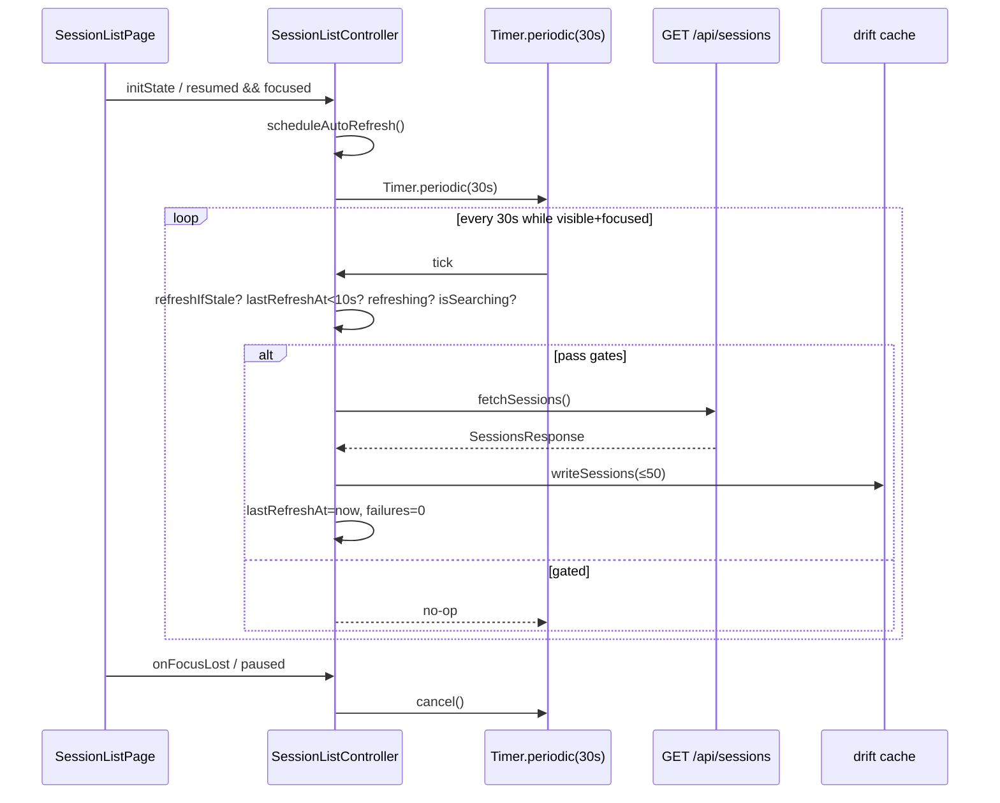
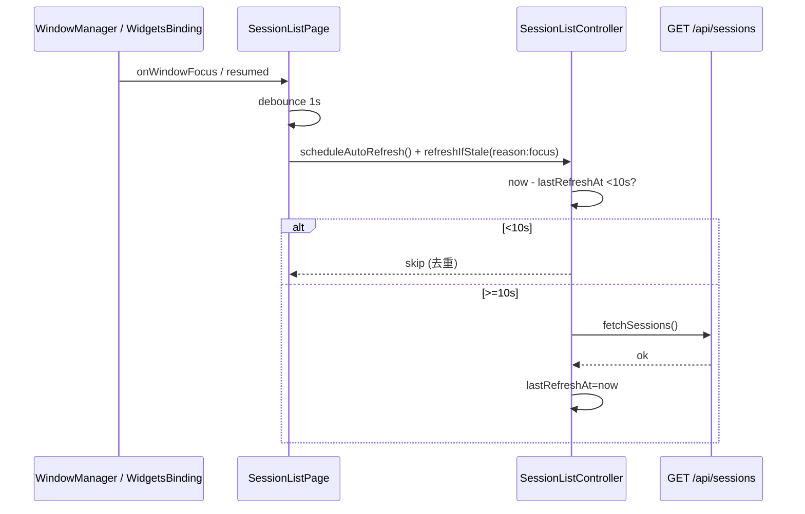
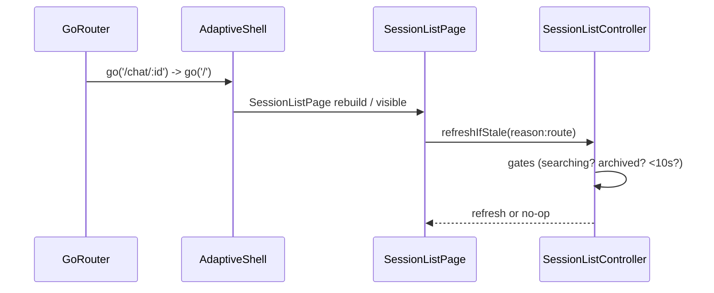

# 会话列表自动刷新规格（session-auto-refresh-spec）

> 版本：v1.0 ｜ 领头人：柚子 ｜ 类型：规格先行（编码前置）
> 产出：`docs/specs/session-auto-refresh-spec.md`
> 模型：`gemini-3.7-flash-high`（固定）
> 约束：不对 `main` 产生 commit；仅落盘规格
> 蓝本：`.reference/hermex-src/Features/SessionList/SessionListViewModel.swift`（`load()` 仅手动触发）、`lib/features/session_list/*`、`lib/app/shell/adaptive_shell.dart`、`lib/features/desktop/*`
> 审计基准提交：以落盘时 `git rev-parse HEAD` 为准（见尾注）

---

## 1. 背景与目标

### 1.1 解决的问题

当前会话列表仅有**移动端下拉刷新**单一触发路径：`lib/features/session_list/session_list_page.dart:136` 的 `CupertinoSliverRefreshControl(onRefresh: _onRefresh)` → `SessionListController.refresh()`。桌面端（Windows/macOS/Linux，`window_manager` + `AdaptiveShell` 双栏）无下拉手势、无定时刷新、无窗口焦点/应用前后台恢复触发，长时间停留在侧栏会导致：新会话（他端创建/定时任务产出）、标题重命名、归档/置顶变更、分支产出等不可见，需手动切页或重启才出现。

### 1.2 设计目标（Goals）

- G1 低开销及时性：单次请求仅 `GET /api/sessions`（不含 `messages`，见 `Endpoint.sessions()`、`ApiClientSessions.sessions()`），轻量（<5KB）；避免高频轮询。
- G2 移动端保留下拉刷新不变，桌面端补齐等价的自动与手动触发。
- G3 可见性驱动：仅当列表**真正可见且用户在看**时才轮询；失焦/后台/切走立即停。
- G4 与 drift 离线缓存协同：刷新成功即写缓存，失败不覆盖缓存（对齐现有 `CacheService.writeSessions` / `shouldUseCache` 语义）。
- G5 可测试、可观测：状态机显式暴露 `lastRefreshAt/lastAttemptAt/refreshing`，便于 `fake_async` 单测与 UI 加载态。

### 1.3 非目标（Non-Goals）

- 不引入 SSE/WS 推送（服务端无会话列表推送事件；`docs/PROTOCOL_NOTES.md` 的 SSE 仅面向 `chat/stream`）。
- 不做 `GET /api/sessions` 的服务端分页（服务端当前一次全量返回，客户端 `pageSize=50` 仅分块渲染，见 `SessionListState.pageSize`）。
- 不改变现有 `CustomScrollView` + `SliverPersistentHeader` 的滚动/分页交互。

---

## 2. 现状审计（As-Is Audit）

### 2.1 刷新路径现状（唯一路径）

| 层 | 文件:行号 | 能力 | 备注 |
|---|---|---|---|
| UI 入口 | `lib/features/session_list/session_list_page.dart:136` | `CupertinoSliverRefreshControl(onRefresh: _onRefresh)` | 视口 `AlwaysScrollableScrollPhysics` + box sliver 顺序约束已处理（`133-136` 注释） |
| UI 回调 | `lib/features/session_list/session_list_page.dart:577-578` | `_onRefresh() => ref.read(...).refresh()` | 纯透传 |
| Controller | `lib/features/session_list/session_list_providers.dart:415-422` | `refresh() { state = AsyncData(await _loadFirstPage(api)); }` | `try/catch → AsyncError`；401 时 `_tryAutoReauth()` 一轮重试 |
| Loader | `lib/features/session_list/session_list_providers.dart:344-387` | `_loadFirstPage()` | 成功后 `cacheService.writeSessions`（50 条上限，`cache_service.dart:14`），失败时 `shouldUseCache` 走 `readSessions()` 兜底 |
| State | `lib/features/session_list/session_list_providers.dart:152-296` | `SessionListState` | 仅 `sessions/visibleCount/searchQuery/filterMode/...`，**无任何时间戳/轮询字段** |

结论：仅移动端下拉刷新，无桌面端触发、无定时、无焦点/前台恢复。用 `ref.watch(apiClientProvider)` 驱动的 `build()` 自动重载仅在**切换服务器**时触发，不覆盖同会话内的增量更新。

### 2.2 grep 统计：Timer / poll / lifecycle 现状

执行（`search_files` 聚合，`pattern: Timer|poll|lifecycle|WidgetsBindingObserver|didChangeAppLifecycleState|WindowListener|windowManager`）：

- `Timer` 命中：`session_list_page.dart:63`（`_searchDebounce` 350ms）、`chat_controller.dart:44-47`（`_mergeTimer/_revealTimer/_watchdogTimer` 等 4 个）、`chat_spec.md:147/329` 文档、`cache` 等；**会话列表无任何周期性 Timer**。
- `poll` 命中：0（除文档中 `oauth/poll` 端点名）；无轮询逻辑。
- `lifecycle` 命中：`lib/app/app.dart:5` + `lib/features/notifications/notification_lifecycle_observer.dart:30/51`（`WidgetsBindingObserver.didChangeAppLifecycleState → appLifecycleStateProvider`）、`lib/features/desktop/desktop_lifecycle_observer.dart`（`DesktopLifecycleObserver` 仅管托盘/窗口记忆/标题，未监听会话刷新）；**会话列表未订阅 `appLifecycleStateProvider`**。
- `WindowListener`：仅 `lib/features/desktop/window_memory.dart:77`（`WindowMemoryService with WindowListener` 监听 `onWindowClose/onWindowResize` 做记忆），**无 `onWindowFocus/onWindowBlur` 监听**。
- `windowManager`：`main.dart:22-26` / `driver_main.dart:30-31` 仅初始化与最小尺寸；`desktop_lifecycle_observer.dart:162` 仅 `setPreventClose`。

一句话现状：**无任何会话列表维度的 Timer 轮询、lifecycle 联动、窗口焦点联动**。

### 2.3 桌面能力现状（`lib/features/desktop/*` / `lib/app/shell/adaptive_shell.dart`）

- `AdaptiveShell`（`adaptive_shell.dart:40-134`）：`kAdaptiveBreakpoint=900`，宽屏 `Row[320px SessionSidebar | ResizeHandle | Expanded child]`，`/` 根路由在宽屏右侧展示 `EmptyDetailPane`，侧栏常驻 `SessionListPage(showUtilityRows:false, showFab:false)`。侧栏本身**始终可见**（非按需挂载），因此「侧栏可见」不等价于「路由为 `/`」。
- `DesktopLifecycleObserver`（`desktop_lifecycle_observer.dart:18-209`）：初始化 `tray/windowMemory/shortcuts/title`，监听 `desktopSettingsProvider/activeSessionIdProvider/sessionListControllerProvider`（仅更新托盘菜单），**未暴露窗口焦点状态的 Provider**。
- `SessionListHeaderDelegate`（`session_list_header.dart:15-224`）：`compactHeader=true` 时为单行头部（`searchField + actions`），`actions` 由 `SessionListPage.build:125-131` 注入（当前为筛选 + 设置/新建），**无刷新按钮**。

### 2.4 API 开销基线

- `GET /api/sessions`（`endpoints.dart:109-119`）：`include_archived=false` 时为裸 `GET /api/sessions`，无 query；不含 `messages`（`GET /api/session?session_id=...&messages=1` 才是消息详情，`endpoints.dart:136-152`），响应 `SessionsResponse {sessions: SessionSummary[], archived_count?}`。
- `SessionSummary` 单条约 150-300 字节 JSON（`sessionId/title/updatedAt/pinned/archived/projectId/...`，`core/models/session.dart`），50 条全量约 8-15KB 未压缩，gzip 后 3-5KB。空闲列表（<20 条）单次 <5KB 符合约束。
- 服务端为一次全量返回（无 `offset/limit`），客户端仅分块渲染（`visibleCount` stepping 50，`loadMore()`），因此**一次刷新 = 一次全量 `GET /api/sessions`**，无分页请求放大。

### 2.5 Hermex 蓝本对照

`SessionListViewModel.swift:209-263` 的 `load()` 仅手动调用（`ContentView` 的 `.task` / `refreshable` / `onAppear`），无定时器；`refreshActiveSessionStatesIfNeeded(streamIDs:)`（`390-417`）仅在 chat 流结束时按 `streamID` 探活 `GET /api/chat/stream/status` 再决定是否 `load()`，不等价于会话列表定时刷新。结论：**Hermex 原生亦无会话列表轮询**，Flutter 侧无需对齐蓝本轮询，按最小可用设计自洽即可。

### 2.6 hermes-webui 对比

`hermes-webui`（`nesquena/hermes-webui`）的会话侧栏为 React 前端，未在公开文档中声明会话列表轮询策略；经 `references` 与端点表（`docs/specs/backend-api-catalog.md`）检索，`/api/sessions` 为纯拉取式，无 SSE 推送。按**最小可用设计**处理：前端自行实现可见性驱动轮询（与本规格一致），不等待服务端推送。

---

## 3. 设计总览（Proposed）

### 3.1 触发矩阵（Trigger Matrix）

| 触发 | 平台 | 条件 | 动作 | 去重 |
|---|---|---|---|---|
| A. 下拉刷新 | 移动端（窄屏） | `CupertinoSliverRefreshControl` overscroll | `refresh()` | 复用现有路径 |
| B. 可见性驱动轮询 | 全平台 | `SessionListPage` 已挂载 **且** `AppLifecycleState.resumed` **且** 窗口聚焦（桌面）/ 前台（移动） | 每 30s `refreshIfStale()` | `refreshing` 互斥 + `lastAttemptAt` 节流 |
| C. 切回前台/窗口获焦即时刷新 | 全平台 | `AppLifecycleState.resumed` 或 `WindowFocus=true` | debounce 1s 后 `refreshIfStale()` | 距 `lastRefreshAt <10s` 则跳过 |
| D. 路由返回/侧栏重见 | 全平台 | `GoRouter` 切回 `/` 或 `AdaptiveShell` 侧栏重建/可见 | `refreshIfStale()` | 同 C 的 10s 窗口 |
| E. 手动刷新按钮 | 桌面端 | `SessionListHeader` 常驻刷新图标 | `refresh()` | 同 A |
| F. 失败指数退避（可选） | 全平台 | B/C/D/E 的网络失败 | 下次轮询延迟 `min(30s * 2^n, 120s)` | 计数 `consecutiveFailures`，成功清零 |

**双条件约束（B 的核心）**：轮询 Timer 仅当 `AppLifecycleState.resumed && windowFocused==true` 同时满足时运行；任一变为 false 立即 `cancel()`。移动端无窗口概念，`windowFocused` 恒 `true`。

### 3.2 与现有 `refresh()` 的关系

- 保留 `refresh()` 语义不变：无条件全量拉取（供 A/E 与错误态重试使用），内部仍走 `_loadFirstPage()` + `writeSessions`。
- 新增 `refreshIfStale()`：**条件刷新**，先做三道门槛判定（见 §5.2），任一不满足直接 no-op，不发请求。
- 新增 `scheduleAutoRefresh()/cancelAutoRefresh()`：管理周期 Timer 的生命周期（页面 `initState/dispose` + 焦点/lifecycle 监听中调用）。

---

## 4. 状态扩展（State Extension）

### 4.1 `SessionListState` 新增字段（`lib/features/session_list/session_list_providers.dart:152-206`）

```dart
class SessionListState {
  // ... 现有字段保持不变 ...
  /// 最近一次成功刷新的时间（UTC）。null = 尚未成功过。
  final DateTime? lastRefreshAt;
  /// 最近一次刷新尝试的时间（含失败）。null = 尚未尝试过。
  final DateTime? lastAttemptAt;
  /// 当前是否有刷新在途（供 UI 展示菊花/禁用按钮）。
  final bool refreshing;
  /// 连续失败次数（指数退避用；成功清零）。
  final int consecutiveFailures;
}
```

- `lastRefreshAt` 仅在 `_loadFirstPage()` 成功（含缓存写入）后更新。
- `lastAttemptAt` 在每次 `refresh()` / `refreshIfStale()` 发起网络请求前更新（含失败路径）。
- `refreshing` 为 UI 派生位，不持久化；`true` 期间所有触发的 `refreshIfStale()` 直接返回（互斥）。
- `consecutiveFailures` 仅内存态，成功清零，失败 `+1`（用于计算下次退避间隔）。

`copyWith` 需新增对应参数（`DateTime? Function()? lastRefreshAt` 等 nullable 包装，保持现有 `searchQuery` 风格）。

### 4.2 派生 Provider（可选）

```dart
/// 是否正在刷新（供 Header 按钮转菊花）。
final sessionListRefreshingProvider = Provider<bool>((ref) =>
  ref.watch(sessionListControllerProvider).valueOrNull?.refreshing == true);
```

### 4.3 新增 Provider：窗口焦点

```dart
// lib/features/desktop/window_focus_provider.dart
final windowFocusedProvider = StateProvider<bool>((ref) => true);
```

- 桌面端由 `WindowFocusObserver`（`with WindowListener`，监听 `onWindowFocus/onWindowBlur`）驱动；非桌面端恒 `true`。
- `AdaptiveShell` 或 `DesktopLifecycleObserver` 中挂载该 Observer，亦可独立 `WindowFocusObserver` widget 挂在 `HermexApp` 根部。

### 4.4 `appLifecycleStateProvider` 复用

已存在 `lib/features/notifications/notification_lifecycle_observer.dart` 驱动的 `appLifecycleStateProvider`（`NotificationLifecycleObserver.didChangeAppLifecycleState`），直接复用，无需新增。

---

## 5. Controller 扩展（Controller Extension）

### 5.1 新增私有成员（`SessionListController`）

```dart
class SessionListController extends AsyncNotifier<SessionListState> {
  Timer? _autoRefreshTimer;
  Timer? _focusDebounce;
  DateTime? _lastScheduleAt; // 防抖：schedule 1s 内重复调用合并
  bool _refreshInFlight = false;
}
```

- 所有 Timer 均为 `dart:async` 标准 `Timer`，`ref.onDispose` 中 `cancel()`。
- `_refreshInFlight` 与 `state.refreshing` 双保险：前者防并发 `_loadFirstPage` 重入，后者驱动 UI。

### 5.2 核心方法签名

```dart
/// 启动/重建可见性驱动轮询（幂等）。
/// 仅当 mounted + resumed + windowFocused 时真正起 Timer；否则 no-op。
void scheduleAutoRefresh();

/// 停止轮询（失焦/后台/页面 dispose 时调用）。
void cancelAutoRefresh();

/// 条件刷新：满足全部门槛才发请求，否则 no-op。
/// 门槛：!refreshing && now - lastRefreshAt >= 10s && !isSearching。
Future<void> refreshIfStale({String reason = 'auto'});
```

`refreshIfStale` 判定细则（按序）：

1. `state.valueOrNull == null` → 直接 `refresh()`（冷启动兜底）。
2. `_refreshInFlight || state.refreshing` → return（去重）。
3. `isSearching == true` → return（搜索模式不自动刷新，避免覆盖 `searchResults`）。
4. `filterMode == archived` → return（归档视图不自动刷新普通列表；归档计数由用户切回全部时刷新）。
5. `lastRefreshAt != null && now.difference(lastRefreshAt!) < 10s` → return（10s 去重窗口，覆盖 C 的「1s debounce + 10s 跳过」）。
6. 否则 `await refresh()`（复用现有 `refresh()` 的 `AsyncData/AsyncError` + `writeSessions` 语义）。

`refresh()` 本身需增强：

- 入口置 `_refreshInFlight=true` + `state.refreshing=true`（通过 `copyWith`），出口 `finally` 清理。
- 成功：`lastRefreshAt=now`、`lastAttemptAt=now`、`consecutiveFailures=0`。
- 失败：`lastAttemptAt=now`、`consecutiveFailures+1`，并按 `shouldUseCache` 决定是否保持旧列表（现有逻辑已具备）。

### 5.3 轮询调度细节

```dart
void scheduleAutoRefresh() {
  cancelAutoRefresh();
  if (!_isVisibleAndFocused) return; // resumed && windowFocused && mounted
  final delay = _nextDelay(); // 30s * 2^failures capped 120s
  _autoRefreshTimer = Timer.periodic(delay, (_) => refreshIfStale(reason: 'poll'));
}

Duration _nextDelay() {
  final failures = state.valueOrNull?.consecutiveFailures ?? 0;
  if (failures == 0) return const Duration(seconds: 30);
  final exp = 30 * (1 << failures); // 30,60,120,120...
  return Duration(seconds: exp.clamp(30, 120));
}
```

- 失败后下一次 `scheduleAutoRefresh()` 会自动取退避间隔；成功后下一次恢复 30s。
- `Timer.periodic` 每次 tick 前再次检查 `_isVisibleAndFocused`，若已失焦则 `cancelAutoRefresh()` 并 return（防竞态：Timer 回调在失焦后仍 firing）。

### 5.4 焦点/前台恢复的 debounce

```dart
void _onFocusGained() {
  _focusDebounce?.cancel();
  _focusDebounce = Timer(const Duration(seconds: 1), () {
    scheduleAutoRefresh(); // 重建周期轮询
    unawaited(refreshIfStale(reason: 'focus'));
  });
}
void _onFocusLost() => cancelAutoRefresh();
```

- `AppLifecycleState.resumed` 与 `windowFocusedProvider` 的 `ref.listen` 均走此 debounce（1s 合并，避免窗口快速切换抖动）。
- `lastRefreshAt <10s` 的去重在 `refreshIfStale` 内统一处理，无需在此重复判断。

### 5.5 路由可见性

```dart
// SessionListPageState.didChangeDependencies 或 ref.listen(routerProvider)
void _onRouteRevealed() {
  // 仅当 matchedLocation == '/' 或 AdaptiveShell 侧栏可见时
  unawaited(ref.read(sessionListControllerProvider.notifier).refreshIfStale(reason: 'route'));
}
```

- 窄屏：监听 `GoRouter.routerDelegate.addListener`（复用 `DesktopLifecycleObserver._onRouteChanged` 模式）或 `ref.listen(routerProvider)`。
- 宽屏：`AdaptiveShell` 侧栏常驻，无需路由触发；但为覆盖「从 `/chat/:id` 返回 `/`」场景，仍保留路由监听（双栏下切回 `/` 亦会触发）。

---

## 6. UI 集成（UI Integration）

### 6.1 `SessionListPage`（`lib/features/session_list/session_list_page.dart`）

- `State` 混入 `WidgetsBindingObserver` **或** 复用 `appLifecycleStateProvider` 的 `ref.listen`（推荐后者，避免双重 Observer）。
- `initState`：
  ```dart
  WidgetsBinding.instance.addPostFrameCallback((_) {
    ref.read(sessionListControllerProvider.notifier).scheduleAutoRefresh();
  });
  ```
- `dispose`：`cancelAutoRefresh()` + `cancel _focusDebounce`。
- `ref.listen(appLifecycleStateProvider, ...)` + `ref.listen(windowFocusedProvider, ...)` → `schedule/cancel` + `refreshIfStale`（debounce 1s）。
- `ref.listen(routerProvider, ...)` → `refreshIfStale(reason:'route')`（可选，若 `SessionListPage` 在宽屏侧栏常驻，则路由监听可省略，仅保留焦点/前台触发；为一致性保留）。
- `FutureBuilder` 的 `CupertinoSliverRefreshControl` 保持不变（移动端手势）。

### 6.2 `SessionListHeaderDelegate`（`lib/features/session_list/session_list_header.dart`）

- 新增参数：`VoidCallback? onRefresh`、`bool refreshing`。
- 桌面紧凑模式（`compactHeader=true`）常驻刷新按钮：

  ```dart
  // actions 末尾追加（由 SessionListPage 注入）
  AccessibleButton(
    key: ValueKey('session-list-refresh'),
    label: l10n.refresh,
    onPressed: refreshing ? null : onRefresh,
    child: refreshing
      ? CupertinoActivityIndicator(radius: 10)
      : Icon(CupertinoIcons.refresh, size: 22),
  )
  ```

- 移动端大标题模式**不**展示该按钮（保留下拉手势，避免双入口）。
- 按钮 `minimumSize: 44x44`（`accessibility.dart` 规范），` Semantics` label `l10n.refresh`。

### 6.3 加载态

- `refreshing==true` 时 Header 按钮转菊花 + 禁用点击；列表 `CustomScrollView` 不额外叠加全屏菊花（复用现有 `AsyncValue.isLoading` 的首屏菊花 + `refreshing` 的局部指示）。
- 轮询失败不弹 `actionError`（避免每 30s 弹窗骚扰），仅 `consecutiveFailures` 计数与退避；手动刷新（A/E）失败走现有 `AsyncError` / `actionError` 弹窗。

---

## 7. 与 drift 缓存的协同

- 成功路径（`_loadFirstPage` try 块）：`await cacheService.writeSessions(sessions)`（`cache_service.dart:16-31`，`maxSessions=50`，`take(50)`，事务内 `delete+insert`），异常吞掉不阻塞列表（现有 `on Exception` 已处理）。
- 失败路径：`ApiException.shouldUseCache(error)` 为 true 且 `readSessions()` 非空时，返回缓存态 `SessionListState(actionError:'离线缓存：...')`，同时更新 `lastAttemptAt` 与 `consecutiveFailures`，但**不**更新 `lastRefreshAt`（成功时间戳不动，保证下次 `refreshIfStale` 不被 10s 窗口误拦）。
- 离线缓存模式（`isViewingCachedData` 由现有逻辑驱动）下：`refreshIfStale` 仍会尝试网络请求（`shouldUseCache` 分支会再次走缓存），但 `scheduleAutoRefresh` 的双条件（`resumed+focused`）已保证不做无意义后台轮询。

---

## 8. 时序图（Mermaid）

### 8.1 可见性驱动轮询（B）



### 8.2 切回前台/获焦即时刷新（C）



### 8.3 路由返回刷新（D）



---

## 9. 阈值表（Thresholds）

| 参数 | 值 | 说明 | 可调 |
|---|---|---|---|
| 轮询周期（基准） | 30s | 可见且聚焦时的周期 | 否（规格锁死） |
| 前台/获焦 debounce | 1s | 合并窗口抖动与快速切换 | 否 |
| 即时刷新去重窗口 | 10s | `now - lastRefreshAt <10s` 则跳过（C/D 共享） | 否 |
| 失败退避 | `30 * 2^n` capped 120s | `n=consecutiveFailures`，成功清零 | 可选实现 |
| 退避上限 | 120s | 连续失败 2 次后封顶 | 是 |
| 单次响应大小 | <5KB (gzip) | `GET /api/sessions` 轻量（不含 messages） | — |
| 缓存上限 | 50 条 | `CacheService.maxSessions` | 已有 |
| 缓存 TTL | 7 天 | `CacheService.ttl` | 已有 |
| 搜索防抖 | 350ms | 现有 `session_list_page.dart:597` | 已有，不变 |

---

## 10. 开销评估（Cost）

### 10.1 请求量

- 基准：30s 周期，持续可见 5 分钟 → `5*60/30 = 10` 次 `GET /api/sessions`。
- 实际：用户不会持续 5 分钟盯着列表不动；切到 chat/workspace/kanban 时轮询已停（`cancelAutoRefresh`），因此 5 分钟空闲约 10 次为**上限**，日常使用远低于此（多数会话在 chat 页，列表仅短暂可见）。

### 10.2 网络

- 单次 <5KB（gzip，20 条以内；50 条满载约 8-15KB 未压 / 3-5KB gzip）。
- 5 分钟上限 10 次 → 约 30-50KB 总流量，相当于 1 张缩略图。
- 失败退避后进一步降低（120s 周期时 5 分钟仅 2-3 次）。

### 10.3 电量/性能

- 无 SSE/WS 长连，仅短轮询；失焦/后台立即停，不存在后台唤醒。
- `Timer.periodic` 在 Dart isolate 内轻量，无平台 channel 轮询；`refreshIfStale` 的门槛判定为纯内存比较，无 I/O。
- `writeSessions` 为 `drift` 事务（50 条 `insertOnConflictUpdate`），单次 <10ms（内存 DB 更低），不阻塞 UI（`unawaited` + `on Exception` 吞掉）。

### 10.4 服务端

- `GET /api/sessions` 为内存/DB 简单查询，无消息展开（`messages=0`），QPS 影响可忽略；30s 周期对单用户 QPS 贡献 0.033。

---

## 11. 边界与异常（Edge Cases）

| 场景 | 行为 | 依据 |
|---|---|---|
| 无网络（`NetworkException.offline/cannotConnect/timedOut`） | `shouldUseCache==true` → 返回缓存列表 + `actionError:'离线缓存：...'`（现有 `_loadFirstPage:370-384`）；轮询失败计 `consecutiveFailures` 并退避，不弹 actionError | `api_exception.dart:17-35` |
| HTTP 408/502/503/504 | 同上，走缓存兜底（`shouldUseCache` 含这些状态码） | 同上 |
| 401 未授权 | `_tryAutoReauth()` 一轮重试（用 `activeConnection.password` 调 `POST /api/auth/login`）；成功则重放 `GET /api/sessions`，失败则 `AsyncError`（UI 展示错误 + 重试按钮），轮询继续但下次仍会 401→退避 | `session_list_providers.dart:362-367/392-411` |
| 离线缓存模式（`isViewingCachedData`） | 仍允许 `refreshIfStale` 尝试网络（成功即退出离线横幅），但轮询的双条件已保证后台不刷 | 现有 `isViewingCachedData` 语义 |
| 搜索模式（`isSearching`/`searchQuery!=null`） | `refreshIfStale` 直接 no-op，不覆盖搜索结果；用户清空搜索后下次轮询恢复 | §5.2 门槛 3 |
| 归档筛选（`filterMode==archived`） | 同上 no-op；归档列表由 `fetchArchived()` 单独管理，不随普通列表轮询 | §5.2 门槛 4 |
| 多窗口/多 isolate | 仅单窗口场景；`windowFocusedProvider` 按主窗口 `WindowListener` 驱动，副窗口不额外刷 | `window_manager` 单窗口假设 |
| 并发刷新（用户下拉 + 轮询同时） | `_refreshInFlight` 互斥，后到者直接 return，不叠加请求 | §5.2 门槛 2 |
| 页面未挂载 | `scheduleAutoRefresh` 首行检查 `mounted`（`State.mounted` 或 `ref.mounted`），未挂载不建 Timer | — |
| 快速前后台抖动 | 1s debounce 合并，10s 去重窗口二次保险 | §5.4 |

---

## 12. 实现步骤（Implementation Steps，不在本规格执行）

1. 新增 `lib/features/desktop/window_focus_provider.dart` + `WindowFocusObserver`（`with WindowListener`，`onWindowFocus/onWindowBlur → windowFocusedProvider`）。
2. 扩展 `SessionListState`（`lastRefreshAt/lastAttemptAt/refreshing/consecutiveFailures`）与 `copyWith`。
3. 扩展 `SessionListController`（`scheduleAutoRefresh/cancelAutoRefresh/refreshIfStale/_nextDelay/_isVisibleAndFocused`，增强 `refresh()` 的 `refreshing/consecutiveFailures` 语义，`ref.onDispose(cancelAutoRefresh)`）。
4. 修改 `SessionListPage`（`initState/schedule`、`dispose/cancel`、`ref.listen(appLifecycleStateProvider + windowFocusedProvider)` 的 debounce 联动、`ref.listen(routerProvider)` 可选、`refreshing` 透传至 Header）。
5. 修改 `SessionListHeaderDelegate`（桌面紧凑模式常驻刷新按钮，`refreshing` 菊花态）。
6. 单测：`test/features/session_list/session_auto_refresh_test.dart`（`fake_async` 覆盖 30s tick、10s 去重、1s debounce、失焦停、搜索/归档 no-op、失败退避）。
7. 手测：窄屏下拉、宽屏按钮、窗口失焦/获焦、前后台、路由往返、断网/401。

---

## 13. 测试要求（Testing）

- `fake_async` 驱动 `Timer.periodic`：验证 30s 周期、60s/120s 退避、失焦 cancel、获焦重建。
- `ProviderContainer` 注入 `SessionListApi` fake：计数 `fetchSessions` 调用次数，断言去重窗口内不发请求。
- 搜索/归档模式下 `refreshIfStale` no-op 断言。
- `flutter analyze` 零告警（含 `unawaited_futures/discarded_futures`），`flutter test` 全绿。

---

## 14. 文件清单（File Map）

| 文件 | 动作 | 说明 |
|---|---|---|
| `docs/specs/session-auto-refresh-spec.md` | 新增（本文） | 规格落盘 |
| `lib/features/session_list/session_list_providers.dart` | 待改 | State 扩展 + Controller 轮询方法 |
| `lib/features/session_list/session_list_page.dart` | 待改 | 生命周期/焦点/路由监听 + 调度 |
| `lib/features/session_list/session_list_header.dart` | 待改 | 桌面刷新按钮 |
| `lib/features/desktop/window_focus_provider.dart` | 待新增 | 窗口焦点 Provider + Observer |
| `lib/app/app.dart` 或 `lib/features/desktop/desktop_lifecycle_observer.dart` | 待改 | 挂载 `WindowFocusObserver` |
| `test/features/session_list/session_auto_refresh_test.dart` | 待新增 | 单测 |

---

## 15. 风险与回滚（Risks）

- 风险：30s 轮询在弱网下放大失败重试 → 已由退避 capped 120s 缓解；且失焦即停，实际影响有限。
- 回滚：`scheduleAutoRefresh` 为纯新增逻辑，删除调用即回退至仅下拉刷新；`SessionListState` 新增字段均为 nullable/默认值，旧代码兼容。

---

## 16. 审计追溯（Traceability）

- 现有刷新入口：`lib/features/session_list/session_list_page.dart:136,577`
- 现有 Controller：`lib/features/session_list/session_list_providers.dart:323-962`（`refresh/loadMore/search/_loadFirstPage`）
- 现有缓存：`lib/core/cache/cache_service.dart:16-45`、`lib/core/api/api_exception.dart:17-35`（`shouldUseCache`）
- 现有桌面/生命周期：`lib/app/app.dart:31`（`DesktopLifecycleObserver` 根挂载）、`lib/features/desktop/desktop_lifecycle_observer.dart:18-209`、`lib/features/notifications/notification_lifecycle_observer.dart:29-57`、`lib/app/shell/adaptive_shell.dart:40-134`、`lib/features/session_list/session_list_header.dart:15-224`
- grep 统计：`Timer`（会话列表仅搜索防抖）、`poll`（0）、`WindowListener`（仅 `window_memory.dart:77`）、`windowManager`（仅初始化与 `setPreventClose`）
- Hermex 蓝本：`SessionListViewModel.swift:209-263`（`load()`）、`390-417`（`refreshActiveSessionStatesIfNeeded`）

---

*— 规格结束，待编码子代理按 §12 步骤实现 —*
